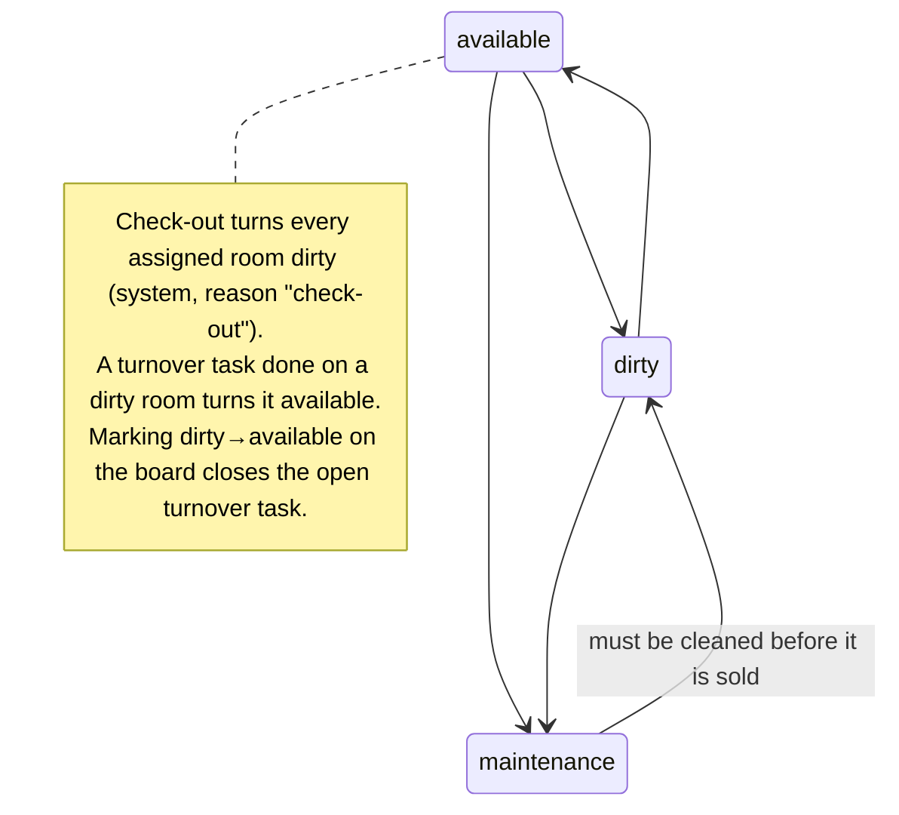
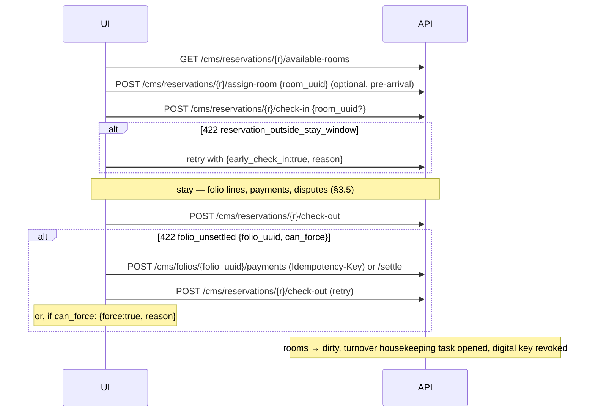
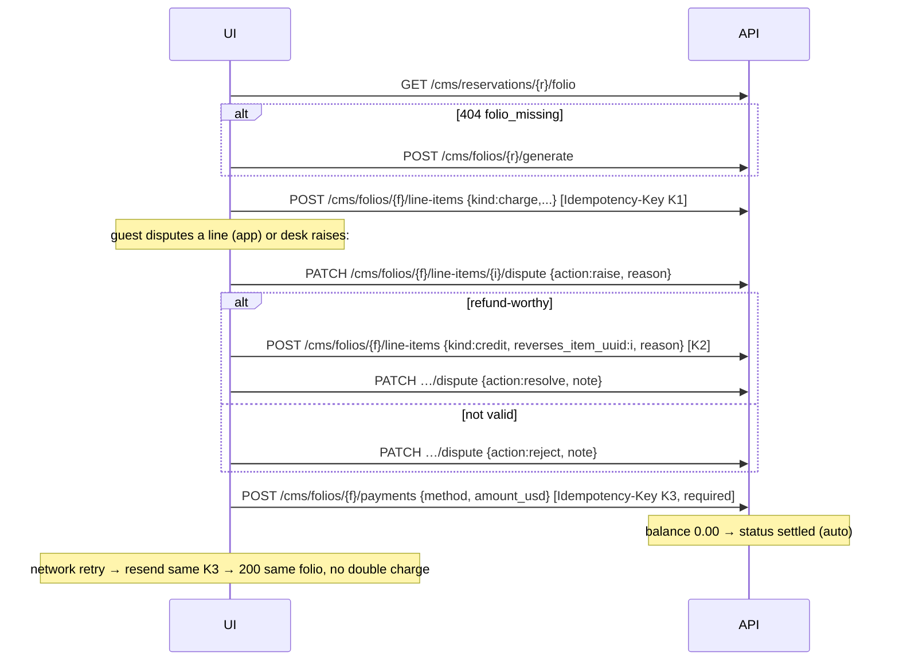
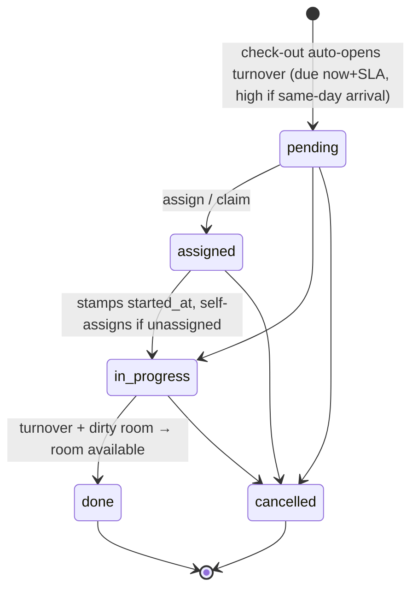
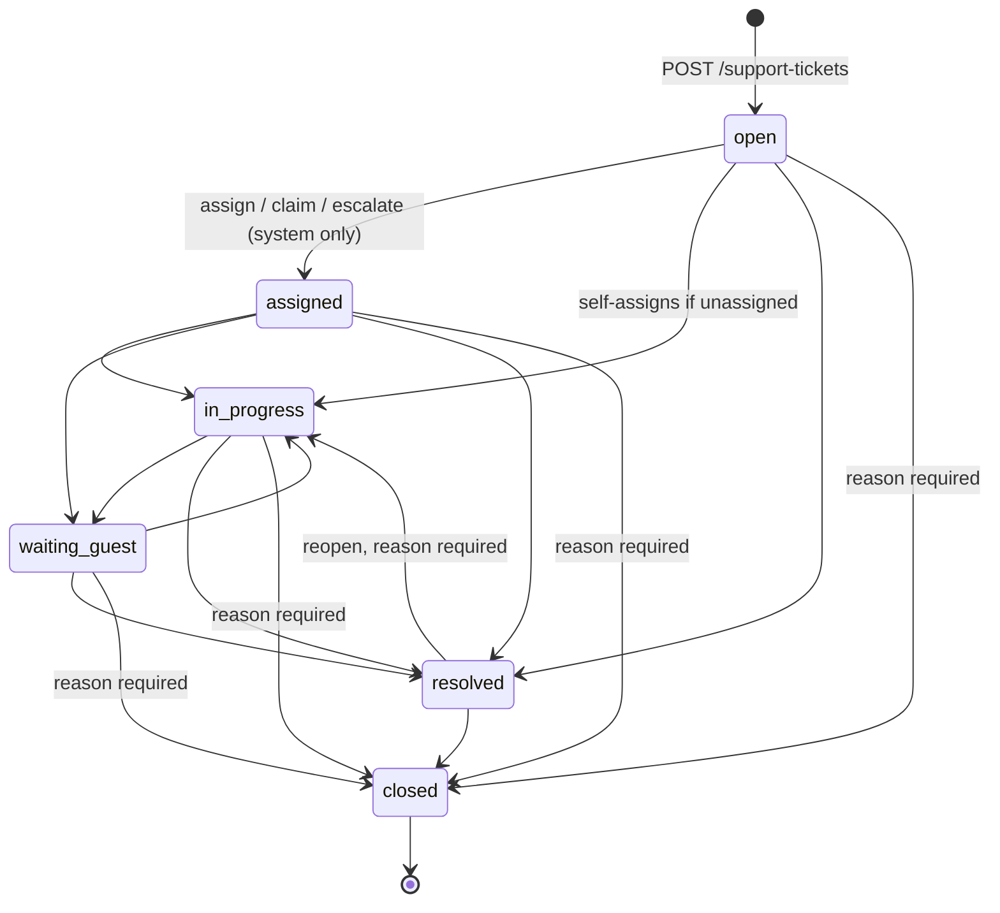
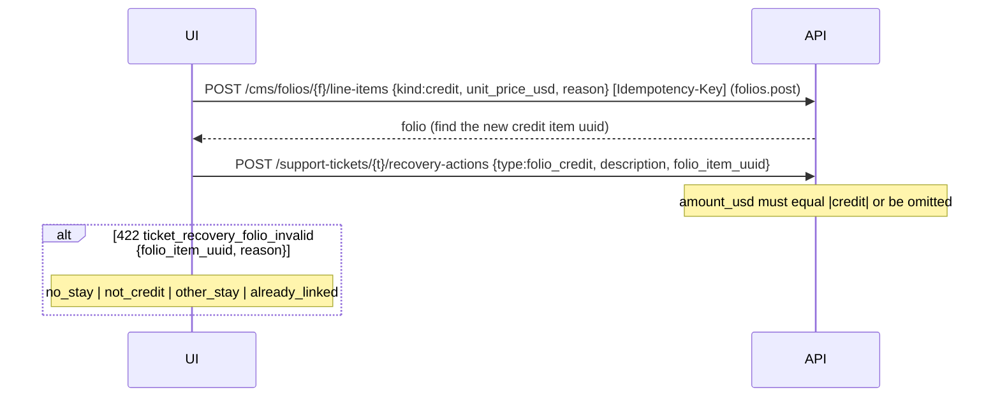
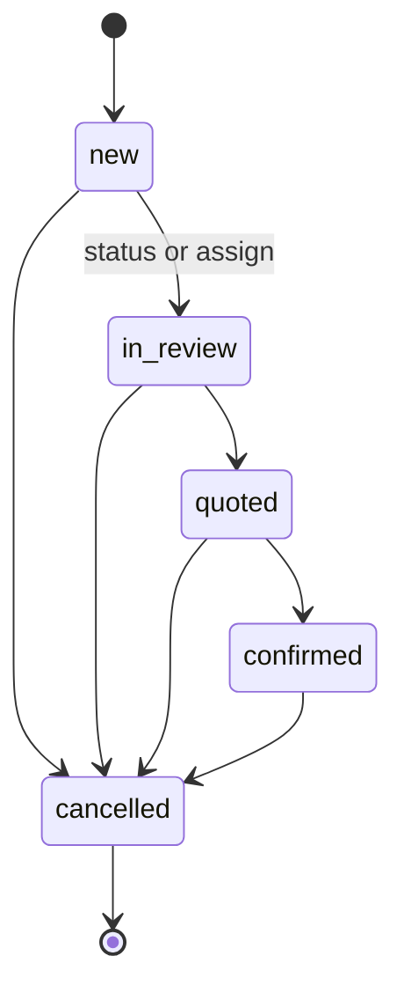

# Carlton Dashboard: Frontend Handoff (API gap closure, Phases 1–10)

**Audience:** the React staff-dashboard developer who wires every new backend API and closes the dashboard side of the capability tree (`docs/carlton-tree.html`).
**Status:** Phases 1–9 are built and tested (2376 tests green at the Phase 9 close). Phase 10 (Loyalty) is **planned, not built**. See §6.
**Sources:** `backend/docs/API_GUIDE_DASHBOARD.md` is authoritative for shapes. Use this file for orientation, flows and the wiring checklist, and read the guide when you need full field lists. Every path and gate below was checked against `php artisan route:list` (`backend/routes/api.php`).
**Try it:** run `php artisan migrate:fresh --seed`, then import `backend/docs/postman/` (collection + environment). Every seeded staff account uses the password `password`. Accounts: `super@carlton.demo` (super admin; it bypasses every gate, so a test with it proves nothing about gating), `reception@`, `kitchen@`, `housekeeping@`, `concierge@`, `events@`, `content@` (content_editor), and `newstaff@`/`trainee@` (no role, useful for testing a deny). No seeded account holds `reports.view` or `night_audit.manage`. Grant them with `POST /staff/{uuid}/permissions`.

---

## 1. Quick start

### 1.1 Base URL, headers, auth

| Item | Value |
|---|---|
| Base URL | `https://<host>/api`. **No `/v1`.** All paths below are relative to `/api`. Some planning docs (e.g. the Phase 6 summary) write `/api/v1/...`, and the routes do not match that. |
| Auth | `POST /auth/login` `{email, password}` → `data.token`. Send `Authorization: Bearer <token>` on every staff call (guard `auth:users`). Login is throttled at 10/min per IP (`429 too_many_requests`). |
| Headers | `Accept: application/json`, `Content-Type: application/json` (multipart for uploads), `Accept-Language` |
| Identity | `user.uuid` everywhere. Integer ids are never exposed. Route params are UUIDs (`{reservation}`, `{folio}`, `{ticket}` … all bind by uuid). |
| Refresh profile/permissions | `GET /auth/me` (same shape as `GET /auth/profile`) |

### 1.2 Response envelope

```json
{ "success": true, "message": "Localized text.", "data": { }, "request_id": "uuid" }
```
Paginated `data`: `{ "items": [...], "meta": { "current_page", "last_page", "per_page", "total" } }`.

Error:
```json
{ "success": false, "message": "Localized.", "error_code": "folio_unsettled",
  "context": { "folio_uuid": "…", "total_usd": "309.00", "can_force": true }, "request_id": "uuid" }
```
Validation (`422 validation_failed`): `errors` is keyed by **field path**: `name.ar`, `settings.3.key`, `capacity.gte`, `idempotency_key`. Translatable fields never produce a bare `name` key.

Rules:
- **Branch on `error_code`, never on `message`.** Treat an unknown code as a generic failure.
- Read `context` to drive the UI. For example `context.allowed` lists the valid transitions and `context.can_force` controls whether the force button shows.
- Log `request_id` (also sent as the `X-Request-Id` header).
- `405 method_not_allowed` (with an `Allow` header) is returned for a wrong verb on a known path. It used to be a 500.
- Login failures are `401 unauthorized` and `403 forbidden` (inactive account). `credentials_invalid` and `account_inactive` are message keys, not codes.

### 1.3 Pagination

- `page`, `per_page`: default 15, clamped at 100 and never an error. **Read the page size you actually got from `meta.per_page`.**
- Exceptions:

| Endpoint | Paging |
|---|---|
| `/cms/reviews` | fixed 15 |
| `/cms/event-inquiries` | 20 per page |
| `/cms/table-reservations` | default 50, max 100 |
| `/operations/staff` | unpaginated, capped at 200, `meta.truncated` |
| `/departure-services` | unpaginated, capped at 500, `meta.truncated` |
| `/operations/queue` | at most 500 rows per type before the merge |
| `/front-desk/*` | unpaginated |
| `/guests/{uuid}` | embedded lists: 25 stays, 10 notes |

- Filters use the DSL `?field=v`, `?field[eq|like|gte|lte|in]=v`, or `?field[]=a&field[]=b`.
  - An unknown param is ignored.
  - An empty value means no filter (use it for "All").
  - An uninterpretable value is `422`.

### 1.4 Localization

- `Accept-Language` accepts `en`, `ar`, `fr`, `tr`, `es`, and full browser headers are negotiated. **It only localizes `message` and validation strings.**
- Translatable content comes back as a locale map, e.g. `{ "en": "…", "ar": "…" }`, and the dashboard renders and edits every locale itself.
  - On create, `en` and `ar` are required.
  - Writes merge per locale.
  - A missing key in a read map means "not translated yet".
- The menu module and the P7 service catalog accept **`en`/`ar` only**. Other keys are dropped without an error.
- Room-board/grid `name` and similar nested names are maps. `table-reservations.venue.name` is already in the request locale.

### 1.5 Idempotency-Key

A request **header**, at most 64 characters. Generate **one UUID per user action** (per click on "Post charge", "Take payment" or "Record deposit") and reuse it on every retry of that action. A body field named `idempotency_key` is ignored.

| Route | Header |
|---|---|
| `POST /cms/folios/{folio}/payments` | **required** (`422 validation_failed`, `errors.idempotency_key`) |
| `PATCH /cms/event-inquiries/{uuid}/deposit` | **required** |
| `POST /cms/folios/{folio}/line-items` | optional, recommended |
| settle routes | not accepted yet |

- **Same key + same payload** returns `200` with the resource as it is **now**. No second write happens. This holds even after the folio auto-settled.
- **Same key + different payload**, or a different staff user, returns `409 idempotency_conflict` with `context: { idempotency_key }`. Mint a new key only if the user really changed the input.
- Keys never expire.

### 1.6 Permission model and nav gating

- After login, store `data.permissions` (identical to `data.user.permissions`). It is the **effective** list: role preset + direct grants − direct revokes.
  - For a super admin it is the full catalogue, so a plain name check works.
  - Never derive permissions from `roles`.
- The server enforces every gate, so hiding UI is a convenience only.
- Refresh with `GET /auth/me` after an admin changes permissions.

**Catalogue: 30 permissions in 13 groups** (`GET /permissions`, needs `staff.manage`):

| Group | Permissions | Enforced on |
|---|---|---|
| reservations | `reservations.view`, `.create`, `.cancel` | `/cms/reservations*`, grids, approvals (`.create`) |
| folios | `folios.view`, `.settle`, `.post`, `.dispute` | `/cms/folios*`, `/cms/reservations/{r}/folio\|settle`, force check-out (`.settle`) |
| cms | `cms.view`, `.edit`, `.restore`, `.purge` | `/cms/*` content: reads `cms.view\|cms.edit`, writes `cms.edit`, bin `cms.restore`/`cms.purge` |
| rooms | `rooms.status` | `PATCH /cms/rooms/{r}/status`, room board |
| service_requests | `service_requests.view`, `.assign`, `.update` | request board, queue, departures, table reservations, staff directory |
| tickets | `tickets.view`, `.assign`, `.respond` | `/support-tickets*`, queue ticket rows, **guest chat** `/cms/conversations*` |
| events | `events.view`, `.manage`, `.deposit` | `/cms/event-inquiries*` |
| pricing | `pricing.edit` | **inert**: enforced nowhere. Build no UI against it. |
| reports | `reports.view` | `/reports/dashboard`, night-audit read |
| night_audit | `night_audit.manage` | night-audit read + all writes |
| staff | `staff.manage` | `/staff*`, `/permissions`, `/roles`. Enforced by a policy, not middleware, but it still answers `403`. |
| guests | `guests.view`, `.edit` | `/guests*` |
| housekeeping | `housekeeping.view`, `.assign`, `.update` | `/housekeeping/tasks*`, queue task rows |

**Role presets** (`GET /roles`):

| Preset | Permissions |
|---|---|
| reception | reservations.view/create/cancel, folios.view/settle/post/dispute, service_requests.view/update, rooms.status, guests.view/edit, housekeeping.view/assign, **tickets.view/respond** |
| kitchen | service_requests.view/update |
| housekeeping | service_requests.view/update, rooms.status, housekeeping.view/assign/update |
| concierge | service_requests.view/assign/update, guests.view/edit, **tickets.view/assign/respond** |
| events | service_requests.view, tickets.view/assign/respond, events.view/manage/deposit |
| content_editor | cms.view/edit/restore |
| content_manager | cms.view/edit/restore/purge |
| (none) | `reports.view`, `night_audit.manage`. Assign per account. A night manager gets both. A night auditor gets `night_audit.manage` only. |

> **Preset changes since the mocks.** Reception and concierge **gained** `tickets.*` in Phase 7. That gives them support tickets **and the guest chat inbox**. They **lost all event-inquiry access** in Phase 8, because events moved to `events.*` and only the `events` preset holds it. Kitchen and housekeeping have no `tickets.*`.

**Nav gating map** (show the item when the user holds ANY of the listed permissions):

| Nav item | Gate |
|---|---|
| Reservations, availability/rates grids | `reservations.view` |
| Room board | `rooms.status` or `reservations.view` |
| Check-in approvals | `reservations.create` |
| Folios | `folios.view` (post `folios.post`, pay/settle `folios.settle`, dispute `folios.dispute`) |
| Guests | `guests.view` |
| Housekeeping board | `housekeeping.view` |
| Service request board, departures, table reservations | `service_requests.view` |
| Live queue, staff directory | `service_requests.view` or `tickets.view` or `housekeeping.view` |
| Support tickets, chat inbox | `tickets.view` |
| Events | **`events.view`** (was `tickets.view`) |
| Night audit | `reports.view` or `night_audit.manage` (actions: `night_audit.manage`) |
| Reports | `reports.view` **only** |
| CMS (read-only) / edit | `cms.view` or `cms.edit` / `cms.edit` |
| Trash / Restore / Delete forever | `cms.restore` or `cms.purge` / `cms.restore` / `cms.purge` |
| Staff & permissions | `staff.manage` |
| Overview summary | any authenticated staff member. Blocks appear per permission, and no permissions returns `{}`. |

---

## 2. Breaking and contract changes (read first)

The dashboard mocks call paths and fields that were **never aliased**. Adopt the real ones.

| # | Area | Mock / old | Real API now | Action |
|---|---|---|---|---|
| 1 | Reservations | `GET /reservations`, `/reservations/{id}` (guest routes, `auth:guests`) | `GET /cms/reservations`, `/cms/reservations/{uuid}` | switch paths |
| 2 | New booking | `POST /reservations` | `POST /cms/reservations` | switch |
| 3 | Check-in/out | `/reservations/{id}/check-in`, `/check-out`, `/available-rooms`, `PATCH /reservations/{id}/notes` | `/cms/reservations/{uuid}/check-in` · `/check-out` · `/available-rooms` · `/notes` | switch |
| 4 | **assign-room (BREAKING, P3)** | assign-room checked the guest in | assign-room **only assigns/moves** and never changes `status`. | call `check-in` explicitly |
| 5 | **Folio settle (BREAKING, P5)** | double settle → `reservation_state` | `422 folio_settled` `{folio_uuid, settled_at}`. `amount_usd` is optional, and a zero balance closes without a payment. | update the error branch |
| 6 | Folio mocks | `GET /reservations/{id}/folio`, `POST /folios/{id}/line-items\|payments`, `PATCH …/line-items/{id}/dispute` | `GET /cms/reservations/{uuid}/folio`, `POST /cms/folios/{uuid}/line-items\|payments`, `PATCH /cms/folios/{f}/line-items/{i}/dispute` | switch. Payments **require** `Idempotency-Key`. |
| 7 | Guest prefs | `PATCH /guests/{id}/preferences` (mock) | `PATCH /guests/{uuid}/preferences` | same path, now real |
| 8 | Service request board | guest route `GET /service-requests` | `GET /cms/service-requests(/{uuid})`. Writes go through `/operations/queue/service-requests/{uuid}/assign\|status`. | switch |
| 9 | Departures | filter chip `luggage_storage` | `luggage` | rename |
| 10 | Queue paths | `/operations/queue/{id}/claim`, `{id}` style | `/operations/queue/{queue_type}/{uuid}/assign\|status\|claim`. Build the path from the row's `queue_type`. | switch |
| 11 | Claim behaviour | claim moved the item to `in_progress` | claim **only assigns**. A ticket goes `open → assigned` and other statuses are kept. | update UI |
| 12 | Staff picker | `/operations/queue/staff` | `GET /operations/staff?type=…` (no alias, the old path is a 404) | switch |
| 13 | Ticket assign | `{owner}` | `{user_uuid}` | rename |
| 14 | Ticket escalate | `{target_owner, level}` | `{user_uuid, reason}`. `level` is server-derived. | rename |
| 15 | Ticket recovery | `{action_type, detail, amount, currency}`, type `transport_hold` | `{type, description, amount_usd}` (USD only). `transport_hold` → `other`. | rename |
| 16 | Ticket priority | `critical` | `low\|normal\|high` | map `critical` to `high` |
| 17 | Ticket transitions (tightening) | free status changes | an enforced table. A PATCH to `assigned` → `422 ticket_transition_invalid`. A reason is required to close a non-resolved ticket or to reopen. | use `allowed_statuses` |
| 18 | Ticket reply | reply moved status to `in_progress` and messaged the guest | reply is an **internal note** with no status change. Answer the guest via `POST /cms/conversations/{conversation_uuid}/messages`. | relabel |
| 19 | Assignee eligibility (tightening) | anyone assignable | every assign verb → `422 assignee_not_eligible` `{user_uuid, required_permission}` when the target lacks the type's work permission | populate pickers from `/operations/staff` |
| 20 | SR assign (tightening) | – | `422 service_request_closed` on a terminal request | handle |
| 21 | Events | `/events/{id}/...` | `/cms/event-inquiries/{uuid}/...` (no alias). Gate `events.view` (was `tickets.view`). | switch |
| 22 | Event notes | body `{notes}` | `{staff_notes}`. `notes` is the client's brief and is read-only. | rename |
| 23 | Event checklist | `{done}` toggle, unknown item `checklist_item_not_found` | `{done}` **required, explicit**. An unknown item → `404 not_found`. `deposit` is derived → `422 event_checklist_item_derived`. | update |
| 24 | Event deposit | body `{amount}`, fields `deposit_paid`, `deposit_amount`, `deposit_received_by`, and the deposit also ticked the checklist | body `{amount_usd, method?, note?}` + `Idempotency-Key`. Read the `deposit{}` object. The checklist row is derived. | update |
| 25 | Event access | reception/concierge saw events | they now get `403`. The `event_inquiries` block of `/dashboard/summary` now follows `events.view`. | re-gate |
| 26 | Night audit | `property_day`, `done`, mock status `in_progress`, gate `FOLIOS_VIEW` | `business_date`, `status`, `open`, gate `reports.view\|night_audit.manage` | rename |
| 27 | **Business date init** | – | nothing exists until the first auditor calls `GET /operations/night-audit?date=<night>`. Without `date` → `422 night_audit_not_initialized`. | send `date` on first use |
| 28 | Reports | mock `revenue_today`, `kpis`, ADR, RevPAR | not provided (§4) | keep mock or drop |
| 29 | Timezone (P8 D-22) | table reservations stored the local time as if it were UTC | `scheduled_at` is the **true UTC instant**. Display `local_date`/`local_time`. "Today" is the hotel-local day (`HOTEL_TIMEZONE`, default `Asia/Damascus`). Old rows are not backfilled. | display the local fields |
| 30 | `PUT /cms/rooms/{uuid}` | accepted `status` | the `status` key is silently ignored | use `PATCH /cms/rooms/{uuid}/status` |
| 31 | Room status vocabulary | `occupied` | housekeeping status is `available\|dirty\|maintenance`. Occupancy is derived on the board. | update |
| 32 | Reservation-level settle | – | `422 folio_settled` once the folio is settled | handle |
| 33 | Inquiry status | `inquiry_state` with no context | adds `context: {status, allowed}` | use `allowed` |

---

## 3. Modules (tree order)

Notation: **P** = permission. Error rows list `code (HTTP) {context}` and the UI action. `401`/`403`/`404`/`422 validation_failed` apply everywhere and are omitted unless they need special handling.

### 3.1 Access & identity

| Endpoint | P | Body / params | Response |
|---|---|---|---|
| `POST /auth/login` | public, 10/min | `{email, password}` | `{user, token, permissions}` |
| `POST /auth/logout` | auth | – | `null` |
| `GET /auth/me`, `GET /auth/profile` | auth | – | user `{uuid,name,email,type,is_active,is_super_admin,roles,permissions}` |
| `PUT /auth/profile` | auth | `{name?, email?, current_password?}`. `current_password` is required when the email changes, and an empty body is rejected. | updated user, "Profile updated." |
| `PUT /auth/password` | auth, **5/min per account** | `{current_password, password (min 8, ≠ current), password_confirmation}` | `null`. **Other sessions are revoked**, and the current token stays valid. |
| `GET/POST /staff`, `GET/PUT /staff/{uuid}` | `staff.manage` | create `{name,email,password,role}`. PUT changes `{name?, email?}` only. | staff `{uuid,name,email,type,is_active,roles,effective_permissions,direct_permissions,role_permissions}` |
| `POST /staff/{uuid}/permissions` | `staff.manage` | `{grant?:[], revoke?:[]}` (no overlap) | staff. `403` if you grant something you don't hold yourself (your own `effective_permissions` is the ceiling) or the target is a super admin. |
| `PATCH /staff/{uuid}/deactivate` | `staff.manage` | – | staff `is_active:false`, all their tokens revoked. `403` on yourself or a super admin. |
| `GET /permissions`, `GET /roles` | `staff.manage` | – | grouped catalogue / 7 presets |

Errors: `PUT /auth/profile` → `errors.current_password` ("The current password is incorrect."). `PUT /auth/password` → `429 too_many_requests` (do not auto-retry). A wrong-current or same password → `422`.

Not available: there is no endpoint to change a staff member's role, no reactivate, and no staff-user search outside `/operations/staff`. The language switch stays client-side.

### 3.2 Rooms & inventory

**Room CMS:** `/cms/room-types`, `/cms/rooms`, `/cms/amenities` (CRUD + bin + images, see the guide's CMS module). `PUT /cms/rooms/{uuid}` ignores `status`.

**`PATCH /cms/rooms/{uuid}/status`**, P `rooms.status`. Body `{status: available|dirty|maintenance, reason?: ≤255}` → room `{uuid, number, floor, status, is_active}`.
Error: `room_status_transition_invalid (422) {from, to, allowed}`. Offer only `allowed`. Same-state is also rejected.



**`GET /front-desk/room-board`**, P `rooms.status|reservations.view`.
- Query: `date?` (Y-m-d), `status?`, `floor?`, `room_type?` (uuid).
- `data: {date, items[]}`, unpaginated. Each item: `uuid, number, floor, room_type{uuid,name}, housekeeping_status, status_changed_at, status_changed_by, occupancy (occupied|vacant), arriving_today, departing_today, stayover, reservation{uuid,guest_name,check_in,check_out,status}|null`.
- Occupancy is per night: a checked-in guest on their departure day reads `vacant` + `departing_today: true` until checked out.

**`GET /front-desk/availability-grid?from&days`**, P `reservations.view`.
- `days` is 1–31 (default 14). `from` defaults to today and cannot be earlier than today−365.
- Returns `{from, days, room_types[{uuid,name,total,cells[{date,free,booked,out_of_order}]}]}`.
- `out_of_order` is **today's** maintenance count repeated on every cell, and it is never subtracted from `free`.

**`GET /front-desk/rates-grid?from&days`**, P `reservations.view`.
- Returns `{from, days, room_types[{uuid,name,base_price_usd,cells[{date,rate_usd,rule_scope}]}]}`.
- Read-only. There is **no API to edit pricing rules** (`pricing.edit` is inert).

### 3.3 Reservations (front desk)

| Endpoint | P | Body / params | Response / notes |
|---|---|---|---|
| `GET /cms/reservations` | `reservations.view` | `status` (eq/in), `folio_status=open\|settled`, `has_open_disputes=1\|0`, page | paginated reservations, newest first |
| `GET /cms/reservations/{uuid}` | `reservations.view` | – | `{uuid, booking_code, status, check_in, check_out, nights, source, payment_method, total_usd, checked_in_at, checked_out_at, check_out_mode, rooms[{room_type, room_uuid, room_number, price_usd}], guest{…, preferences}, promo_code, notes}` |
| `POST /cms/reservations` | `reservations.create` | `guest_uuid` **or** `first_name,last_name` + `phone\|email`. Plus `room_type_uuid, check_in, check_out, payment_method, promo_code?, status? (confirmed\|pending), source? (walk_in\|direct)` | 201 reservation (room reserved immediately). `409 no_availability`. `422` keyed `identity` when no guest identity is sent. |
| `POST /cms/reservations/{uuid}/confirm` | `reservations.create` | – | `422 reservation_state` |
| `GET /cms/reservations/{uuid}/available-rooms` | `reservations.view` | – | `{room_type, check_in, check_out, items[{uuid, number, floor, housekeeping_status, assigned}]}`. The assigned room comes first. |
| `POST /cms/reservations/{uuid}/assign-room` | `reservations.create` | `{room_uuid?}` | `confirmed` or `checked_in` only. It **does not check in**. A move during a stay pushes "room ready" to the guest. |
| `POST /cms/reservations/{uuid}/check-in` | `reservations.create` | `{room_uuid?, early_check_in?, reason? (required if early)}` | "Guest checked in." |
| `POST /cms/reservations/{uuid}/check-out` | `reservations.create` (+ `folios.settle` for `force`) | `{force?, reason? (required if force)}` | reservation + `folio{uuid,status,total_usd,open_disputes_count}` |
| `PATCH /cms/reservations/{uuid}/notes` | `reservations.create` | `{notes: string\|null}` (key required, max 2000) | staff-only `notes` |
| `DELETE /cms/reservations/{uuid}` | `reservations.cancel` | – | 204. Cancellable from `pending_verification\|pending\|confirmed`. It also revokes the digital key. |
| `POST /cms/reservations/{uuid}/settle` | `folios.settle` | `{method: cash\|on_arrival, amount_usd, note?}` | payment object. Use it for pre-departure deposits, which count toward the folio balance. |

Error handling (check-in / assign / check-out):

| Code | Context | UI |
|---|---|---|
| `reservation_state` (422) | `{status, allowed}` | the action is not valid in this status. Disable the button. |
| `reservation_outside_stay_window` (422) | `{check_in, check_out, today}` | offer "early check-in" (the day before `check_in` only) with a reason |
| `room_out_of_order` (422) | `{room_uuid, housekeeping_status}` | the room is in maintenance. Re-pick. |
| `room_already_assigned` (409) | – | another booking holds it. Refresh available-rooms. |
| `no_availability` (409) | – | auto-pick found no free room |
| `folio_unsettled` (422) | `{folio_uuid, total_usd, can_force}` | open the folio for payment. Show "Force check-out" only when `can_force` is true. |
| `forbidden` (403) | – | `force` was sent without `folios.settle` |

**Check-in / check-out flow**



Status reference: `pending_verification → pending → confirmed → checked_in → checked_out`, plus `cancelled` (terminal). `check_out_mode` is `none|staff_force|guest_express|null`.

### 3.4 Stay & check-in (approvals, preferences, guests)

| Endpoint | P | Notes |
|---|---|---|
| `GET /cms/check-in-approvals` | `reservations.create` | paginated `{uuid, reservation_uuid, status, approved_by, notes, documents[{uuid,type}]}` |
| `PATCH /cms/check-in-approvals/{reservation}/approve` | `reservations.create` | URL param is the **reservation** uuid. Body `{status: approved\|rejected, notes?}`. Approve issues the guest's digital key (never returned to staff). Reject revokes it. `404` if nothing has been submitted. |
| `GET /guests` | `guests.view` | `search`, `phone`, `email`, `preferred_locale`, `stay_status` (`in_house\|departing\|arriving\|upcoming\|past\|none`, anything else is 422), `sort` (`name\|last_name\|created_at`). Row: 13 keys incl. `stay_status`, `current_reservation`. |
| `GET /guests/{uuid}` | `guests.view` | profile: `stats`, `preferences`, `current_reservation` (room, room_type, check_in_approval, documents metadata, digital_key **status only**), `pre_arrival_checklist{complete, items[6]}`, `stay_history[≤25]`, `stays_total`, `has_more`, `notes[≤10]`, `notes_count` |
| `GET /guests/{uuid}/notes` | `guests.view` | paginated `{uuid, body, author, created_at}` |
| `POST /guests/{uuid}/notes` | `guests.edit` | `{body ≤2000}` → 201. Append-only (no edit/delete). |
| `PATCH /guests/{uuid}/preferences` | `guests.edit` | any of `bed_type` (king/queen/double/twin/single, **not** extra), `pillow_type`, `floor_preference` (low/high/any), `other`. A missing key is left untouched and `null` clears it. A body with none of them → `errors.preferences`. |

Staff **cannot edit guest identity** (no `PATCH /guests/{uuid}`). Pre-arrival checklist item keys: `documents_uploaded, check_in_approved, preferences_set, arrival_time_set, room_assigned, digital_key_issued`.

### 3.5 Folio & payments

| Endpoint | P | Body | Response |
|---|---|---|---|
| `GET /cms/reservations/{uuid}/folio` | `folios.view` | – | folio. **Pure read**: `404 folio_missing {reservation_uuid, reservation_status}` → call generate. |
| `POST /cms/folios/{reservation}/generate` | `folios.view` | – | folio (idempotent, reconciles in place, item uuids stable) |
| `POST /cms/folios/{folio}/line-items` | `folios.post` | `{kind?: charge\|credit, description, quantity? 1–999, unit_price_usd: "4.50", reason? (credit), reverses_item_uuid? (credit)}` + optional `Idempotency-Key` | 201 folio (200 replay) |
| `POST /cms/folios/{folio}/payments` | `folios.settle` | `{method: cash\|on_arrival, amount_usd ≤ balance, note?}` + **required** `Idempotency-Key` | 201 folio (200 replay). Auto-settles at a 0.00 balance. |
| `PATCH /cms/folios/{folio}/line-items/{item}/dispute` | `folios.dispute` | `{action: raise\|resolve\|reject, reason (raise), note (resolve/reject)}` | the item with its latest `dispute` |
| `POST /cms/folios/{folio}/settle` | `folios.settle` | `{method?, amount_usd?, note?}` | folio. A balance ≤ 0 closes **without** a payment. |

Folio shape (key fields):
```json
{ "uuid":"…","reservation_uuid":"…","status":"open","subtotal_usd":"309.00","total_usd":"309.00",
  "items":[{"uuid":"…","description":"Minibar","amount_usd":"9.00","source_type":"manual","quantity":2,
            "unit_price_usd":"4.50","posted_by":{"uuid":"…","name":"…"},"posted_at":"…","reason":null,
            "reverses_item_uuid":null,"dispute":{"uuid":"…","status":"open","raised_by":"guest","reason":"…"}}],
  "payments":[{"uuid":"…","method":"cash","amount_usd":"100.00","status":"completed"}],
  "paid_usd":"100.00","balance_due_usd":"209.00","open_disputes_count":1 }
```
- Money is a 2-decimal **string**.
- `balance_due_usd` is signed and never clamped. Refunds are not subtracted.
- `source_type` is one of `reservation|service_booking|service_request|manual|credit`.
- The ledger is **append-only**: no edit/delete. Corrections are credit lines.

| Error | Context | UI |
|---|---|---|
| `folio_settled` (422) | `{folio_uuid, settled_at}` | the folio is closed, so make it read-only |
| `folio_credit_exceeds_item` (422) | `{item_uuid, remaining_usd, amount_usd}` | cap the credit at `remaining_usd` |
| `folio_credit_exceeds_balance` (422) | `{balance_due_usd, amount_usd}` | cap the credit at the balance |
| `folio_overpayment` (422) | `{balance_due_usd, amount_usd}` | prefill with the balance. If the balance is 0, use settle. |
| `folio_item_dispute_open` (422) | `{item_uuid, dispute_uuid}` | a dispute is already open, so show resolve/reject |
| `folio_dispute_state` (422) | `{item_uuid, status}` | no open dispute to decide |
| `idempotency_conflict` (409) | `{idempotency_key}` | a different payload was sent under a used key |

**Folio flow**


Disputes never move money and never block check-out.

### 3.6 Dining

**Venues/menus CMS:** `/cms/dining-venues`, `/cms/menu-categories`, `/cms/menu-items`, `/cms/restaurant-tables`, all under the standard CMS gates. Menu and the P7 catalog are `en`/`ar` only and need the **full payload** on update.

**Menu file (upload/download):**

| Endpoint | P | Notes |
|---|---|---|
| `POST /cms/dining-venues/{uuid}/menu-file` | `cms.edit` | multipart `file` (pdf/jpg/jpeg/png/webp, ≤10 MB), `title?` → 201 MediaResource. **Upload replaces** the existing file. |
| `DELETE /cms/dining-venues/{uuid}/menu-file` | `cms.edit` | 200 `data:null`. `404` when the venue has no file. |
| `GET /public/dining-venues/{uuid}/menu/download` | public | 200 `{url, file_name, mime_type, size, updated_at}` (a URL, not a stream). **204 with an empty body and no envelope** when there is no file. Open `url` in a new tab for the "download" button. |

Menu files never appear in `images` or `/cms/media`.

**`GET /cms/table-reservations`**, P `service_requests.view`. Read-only, with no staff write verbs.

| Param | Notes |
|---|---|
| `venue`, `table` | uuid |
| `status` | `pending\|confirmed\|cancelled\|completed`, eq/in |
| `date` **or** `from`+`to` | hotel-local, ≤31 days. Defaults to the hotel-local today. |
| `sort` | `scheduled_at` (default) or `guest_count` |
| `per_page` | ≤100 |

Row: `{uuid, status, scheduled_at (UTC), local_date, local_time, guest_count, special_request, venue{uuid,name}, table{uuid,table_number,capacity}, guest, reservation{uuid,booking_code}}`. Any nested object may be `null`. **Display `local_date`/`local_time`.**

### 3.7 Guest services

**Catalog CMS:** `/cms/service-categories`, `/cms/service-items`, `/cms/spa-services`, `/cms/pool-cabanas`, `/cms/transfers` (`en`/`ar`, full payload on update).

**Staff request board:** `GET /cms/service-requests` (+ `/{uuid}`), P `service_requests.view`.
- Filters: `status`, `department`, `priority`, `type`, `created_at[gte|lte]`, `assignee` (uuid or `unassigned`), `room`, `date`, `guest`.
- Row: `{uuid, type, category_code, department, status, priority, notes, guest, reservation{…,room_number}, service_item, assigned_user, housekeeping_task{uuid,status}|null}`.
- **Writes** go through the queue: `PATCH /operations/queue/service-requests/{uuid}/assign|status`.

**Housekeeping board:**

| Endpoint | P | Notes |
|---|---|---|
| `GET /housekeeping/tasks` | `housekeeping.view` | filters `status`, `type` (turnover/stayover/inspection/request), `priority`, `room`, `assignee` (uuid\|`unassigned`), `due_at[gte\|lte]`, `due_date` (hotel-local). Sort `due_at\|created_at\|priority`. |
| `GET /housekeeping/tasks/{uuid}` | `housekeeping.view` | adds `history[≤10]` |
| `POST /housekeeping/tasks` | `housekeeping.assign` | `{room_uuid, type: turnover\|stayover\|inspection, due_at?, priority?, notes?}` → 201 new, or **200 with the existing open task** (one open task per room+type) |
| `PATCH /housekeeping/tasks/{uuid}/assign` | `housekeeping.assign` | `{user_uuid}`. Errors: `housekeeping_task_closed`, `assignee_not_eligible`. Only the `housekeeping` preset (or a super admin) is assignable. |
| `PATCH /housekeeping/tasks/{uuid}/status` | `housekeeping.update` | `{status, reason?}`. Error: `housekeeping_task_transition_invalid {from,to,allowed}`. |

Task shape: `{uuid, type, status, priority, notes, room{uuid,number,floor,status}, reservation, assigned_user, service_request_uuid, due_at, started_at, completed_at, allowed_statuses}`. **Drive the status buttons from `allowed_statuses`.** An empty array means hide them all.

**Housekeeping turnover flow**


A room-board `dirty→available` closes the open turnover task straight to `done`. A guest service request routed to housekeeping opens a linked `request` task, and that task reaching `done` completes the request.

**Departures:** `GET /departure-services`, P `service_requests.view`.
- `date` is hotel-local today ±30 days. Also takes `kind[in]` (`transfer|late_checkout|luggage|express_checkout`) and `status[in]`.
- Returns `{items, meta{count,truncated}}`, unpaginated (≤500).
- Row: `{uuid, kind, source_type, status, stage (open|in_progress|resolved), allowed_statuses, scheduled_at, reservation, guest, room_number, assigned_user_uuid}`. Build **one** status pill from `stage`.

`PATCH /departure-services/{uuid}/status`, P `service_requests.update`.
- Body `{status, reason?, source_type?}`. Send back the row's `source_type`.
- Errors: `service_booking_transition_invalid {from,to,allowed}`, `departure_service_readonly` (express checkout rows; their `allowed_statuses` is empty).
- Confirming a transfer is what makes the next folio bill it.

### 3.8 Operations

**`GET /dashboard/summary`** (auth only). Returns `{service_requests?, tickets?, event_inquiries?, housekeeping_tasks?}` as status→count maps. Each block depends on its own `.view` permission, and `event_inquiries` follows **`events.view`**.

**Live queue:**

| Endpoint | P | Notes |
|---|---|---|
| `GET /operations/queue` | `service_requests.view\|tickets.view\|housekeeping.view` | merged, newest first, active items only. Row `{type, queue_type, uuid, subject, department, status, priority (low/normal/high), assigned_user_uuid, created_at, room_number, allowed_statuses}`. Types you can't view are omitted (not a 403). |
| `PATCH /operations/queue/{queue_type}/{uuid}/assign` | type's assign perm (`service_requests.assign` / `tickets.assign` / `housekeeping.assign`) | `{user_uuid}`. Errors: `assignee_not_eligible`, `service_request_closed`, `ticket_closed`, `housekeeping_task_closed`. |
| `PATCH /operations/queue/{queue_type}/{uuid}/status` | type's work perm (`service_requests.update` / `tickets.respond` / `housekeeping.update`) | `{status, reason? ≤255}`. Tickets and tasks enforce transitions. |
| `PATCH /operations/queue/{queue_type}/{uuid}/claim` | type's **work** perm | no body → the refreshed row |
| `GET /operations/staff` | same as the queue | `type` (queue_type), `permission` (only `service_requests.update\|tickets.respond\|housekeeping.update`), `department`, `search` → `{items[{uuid,name,type,departments}], meta{count,truncated}}` |

`queue_type` is one of `service-requests | tickets | housekeeping-tasks`. **Always build URLs from it.**

**Claim handling**

| Response | Meaning | UI |
|---|---|---|
| 200 "Queue item claimed." | assigned to you | update the row |
| 200 "already assigned to you" | no-op | nothing |
| **409 `queue_item_already_claimed`** `{assigned_user_uuid}` | someone else holds it | toast "Taken by X" (resolve the name via `/operations/staff`), refresh the row. **Never retry.** A supervisor re-assigns via `/assign`. |
| 422 `ticket_closed` / `housekeeping_task_closed` / `service_request_closed` `{status}` | terminal (a per-type code, there is no shared one) | remove from the queue |
| 403 | no work permission (the assign permission alone is not enough) | hide the claim button |

**Assignable presets per queue type:**

| Queue type | Assignable presets |
|---|---|
| service-requests | reception, kitchen, housekeeping, concierge |
| tickets | events, reception, concierge |
| housekeeping-tasks | housekeeping only |

Use `GET /operations/staff?type=<queue_type>` for every picker.

Live updates come from the Firestore `ops_queue` collection. Branch on the document-id prefix (`service_request_`, `ticket_`, `housekeeping_task_`) because each prefix has its own status vocabulary. There is no websocket (RT-01 deferred).

**Support tickets:**

| Endpoint | P | Body |
|---|---|---|
| `GET /support-tickets` | `tickets.view` | `status, department, source, category, priority` (eq/in), `created_at[gte\|lte]`, `assignee` (uuid\|`unassigned`\|`me`), `guest`, `reservation`, `escalated` (bool), `sort` |
| `GET /support-tickets/{uuid}` | `tickets.view` | – (detail adds `actions[≤200 newest, asc]`, `actions_truncated`, `latest_escalation`) |
| `POST /support-tickets` | `tickets.respond` | `{subject 3–150, category: inquiry\|complaint\|booking_help\|maintenance\|other, description?, priority?, department?, guest_uuid?, reservation_uuid?, room_uuid?}` → 201 |
| `PATCH /support-tickets/{uuid}/status` | `tickets.respond` | `{status, reason? ≤1000}` |
| `PATCH /support-tickets/{uuid}/assign` | `tickets.assign` | `{user_uuid}` |
| `POST /support-tickets/{uuid}/reply` | `tickets.respond` | `{body 1–5000}`. Internal note. |
| `POST /support-tickets/{uuid}/escalate` | `tickets.respond` | `{user_uuid, reason 3–1000}` |
| `POST /support-tickets/{uuid}/recovery-actions` | `tickets.respond` | `{type, description 3–1000, amount_usd?, folio_item_uuid (required iff folio_credit)}` → 201 |

There is no DELETE (405). Ticket shape: `{uuid, subject, description, category, status, priority, department, source, escalation_level, allowed_statuses, guest, reservation, room, conversation_uuid, assigned_user, created_by, folio_credit_total_usd, recorded_value_usd, resolved_at, closed_at, …}`.



**Escalation.** Guards run in this order, each a 422:
1. `ticket_closed`
2. `ticket_escalation_invalid {reason: self|same_assignee}`
3. `ticket_escalation_limit {level, max}` (default max 3)
4. `assignee_not_eligible`

No notification is sent. Watch `assigned_user_uuid` and `?assignee=me`.

**Recovery + folio credit (two-step):**

Other recovery types (`rate_discount, courtesy_amenity, room_upgrade, late_checkout, apology, other`) are **record-only**: they never touch a folio and `folio_item_uuid` is prohibited.

To answer the guest, use `POST /cms/conversations/{conversation_uuid}/messages` (`tickets.respond`, body `{body?, attachment?}`).

**Reports:** `GET /reports/dashboard?date_from&date_to`, P `reports.view` **only**.
- Dates are sent together or not at all. The span is at most 31 days and defaults to the hotel today.

```json
{ "period":{"date_from","date_to","days","timezone"}, "generated_at":"…",
  "occupancy":{"occupied_room_nights":0,"available_room_nights":10,"occupancy_rate":"0.0000"},
  "arrivals":1, "departures":1,
  "revenue":{"basis":"posted_folio_lines","charges_usd","credits_usd","net_usd","by_source":{…}},
  "collections":{"basis":"completed_payments","refunds_included":false,"stays_usd","event_deposits_usd","other_usd","total_usd"},
  "open_work":{"basis":"current_state","as_of","service_requests":{…},"tickets":{…}} }
```
- `occupancy_rate` is not clamped and can exceed 1.
- Event deposits appear in collections only.
- This is an operational view, not audited accounting.

### 3.9 Night audit (Folio & payments group in the tree)

All four routes return `data: {state: {current_business_date, last_closed_date}, audit: null | {...}}`.

| Endpoint | P | Body |
|---|---|---|
| `GET /operations/night-audit?date=Y-m-d` | `reports.view\|night_audit.manage` | – (lazily opens the audit for the current business date) |
| `PATCH /operations/night-audit/checks/{check}` | `night_audit.manage` | `{status: resolved\|overridden, note (1–1000, required)}` |
| `PATCH /operations/night-audit/blockers/{blocker}` | `night_audit.manage` | `{note, status?: "resolved"}` |
| `POST /operations/night-audit/{audit}/close` | `night_audit.manage` | none |

The audit has `readiness{checks_pending, blockers_open, can_close}`, `checks[5]` and `blockers[0..2]`.
- **Check shape:** `type, label, blocking, status (passed|pending|resolved|overridden), issue_count, evidence[≤20], evidence_truncated, note, acted_by, acted_at, blocker_uuid`.
- **The five checks, in fixed order:**

| Check | Blocking |
|---|---|
| `unsettled_departures` | yes |
| `unassigned_arrivals` | yes |
| `dirty_rooms` | no |
| `open_high_priority_tickets` | no |
| `open_folio_disputes` | no |

- A blocker exists only for a non-empty blocking check.
- The audit is a **snapshot at first open** and is never re-evaluated. Fixing the problem does not change `issue_count`, so record the outcome with the PATCH routes.

```mermaid
sequenceDiagram
    participant UI as Night auditor UI
    participant API
    UI->>API: GET /operations/night-audit
    alt 422 night_audit_not_initialized {requires:"date"}
        UI->>API: GET /operations/night-audit?date=<night being closed>
        Note over API: 422 night_audit_date_in_future if after hotel today; 403 {reason} for reports.view-only
    end
    API-->>UI: {state, audit(open, checks[5], blockers[])}
    loop each pending check
        UI->>API: PATCH /checks/{check} {status: resolved|overridden, note}
    end
    loop each open blocker (attestation, not re-checked)
        UI->>API: PATCH /blockers/{blocker} {note}
    end
    UI->>API: POST /{audit}/close
    alt 422 night_audit_not_ready {checks_pending, blockers_open}
        Note over UI: highlight remaining items
    else 200 "Business date closed."
        Note over API: current_business_date += 1 day; no reopen
    end
```

| Error | Context | UI |
|---|---|---|
| `night_audit_not_initialized` | `{requires:"date"}` | show a date picker ("which night are you closing?") |
| `night_audit_date_in_future` | `{requested_date, hotel_today}` | pick an earlier date |
| `night_audit_date_mismatch` | `{requested_date, current_business_date}` | jump to `current_business_date` |
| `night_audit_closed` | `{business_date, closed_at}` | make it read-only |
| `night_audit_item_resolved` | `{item, status}` | refresh |
| `night_audit_not_ready` | `{checks_pending, blockers_open}` | highlight what is left |

- `audit: null` with a 200 means the current business date is ahead of the hotel's today (the night was already closed). Show "Next audit opens on …".
- A past date that has an audit returns that audit as history. There is no history list endpoint.

### 3.10 Guests & messaging

- Guest directory/profile: §3.4.
- Chat inbox:
  - `GET /cms/conversations` (`tickets.view`)
  - `GET /cms/conversations/{uuid}/messages` (`tickets.view`, oldest first)
  - `POST /cms/conversations/{uuid}/messages` (`tickets.respond`, multipart `body?`/`attachment?`). The first staff reply claims the conversation.
  - Live updates come via Firestore (no FCM to staff).
- Review moderation:
  - `GET /cms/reviews` (`cms.view|cms.edit`, fixed 15/page; `?is_published=` **empty means unpublished**)
  - `PATCH /cms/reviews/{uuid}/publish` `{is_published}` (`cms.edit`)
  - The route list also has `GET /cms/reviews/{review}`, although the guide calls the module list-only. Prefer the list.

### 3.11 Events

| Endpoint | P | Body | Notes |
|---|---|---|---|
| `GET /cms/event-inquiries` | `events.view` | page (20/page) | row adds `staff_notes, deposit_status (unpaid\|paid), deposit_paid_at, checklist_done_count, checklist_total (5)` |
| `GET /cms/event-inquiries/{uuid}` | `events.view` | – | detail: `checklist[5]`, `deposit{status, amount_usd, method, paid_at, received_by, payment_uuid}`, `assigned_user`, `guest`, `event_space` |
| `PATCH …/{uuid}/status` | `events.manage` | `{status}` | `new→in_review\|cancelled`, `in_review→quoted\|cancelled`, `quoted→confirmed\|cancelled`, `confirmed→cancelled`. Error `inquiry_state {status, allowed}`. |
| `PATCH …/{uuid}/assign` | `events.manage` | `{user_uuid}` | a `new` inquiry auto-advances to `in_review`. **No eligibility check.** Pick from `/operations/staff?department=events`. |
| `PATCH …/{uuid}/checklist/{item}` | `events.manage` | `{done: bool}` (required) | items `contract, deposit*, guarantee, beo, av`. Re-sending the same state is a 200 no-op. `deposit` → `422 event_checklist_item_derived`. A cancelled inquiry → `inquiry_state`. |
| `PATCH …/{uuid}/notes` | `events.manage` | `{staff_notes: string\|null}` (max 5000) | editable in every status, last write wins |
| `PATCH …/{uuid}/deposit` | `events.deposit` | `{amount_usd 0.01–99999.99, method?: cash, note?}` + **`Idempotency-Key`** | only `quoted\|confirmed`. One per inquiry. No auto-confirm. Never touches a folio. |

Every PATCH returns the full detail, so replace the store object wholesale.

**Deposit flow:**
1. Mint key K and send it.
2. A timeout or retry resends K: 200 with the same result and no second payment.
3. If the user edits the amount, mint a new key. Reusing K with a different payload → `409 idempotency_conflict`.
4. A second deposit under a new key → `422 event_deposit_already_recorded {payment_uuid, paid_at}`. Show "Deposit already recorded".
5. A wrong status → `422 inquiry_state {status, allowed:["quoted","confirmed"]}`.



### 3.12 Content & site (CMS)

Standard CMS for 19 modules + the P7 catalog. Read the guide's "Module: CMS Content" for field lists. Points the dashboard must get right:
- `DELETE` is a **soft delete** ("moved to trash").
- Bin verbs:

| Verb | Path | Gate |
|---|---|---|
| `GET` | `/cms/{module}/trashed` | `cms.restore\|cms.purge` |
| `POST` | `/{uuid}/restore` | `cms.restore` |
| `DELETE` | `/{uuid}/force` | `cms.purge` |

- Restoring a child whose ancestor is binned → `409 ancestor_trashed {ancestor{type,uuid}, trashed_ancestors[]}`. Offer "Restore <ancestor> first". The bin auto-purges after 90 days (configurable).
- Publishing is controlled by `is_active` alone, and it **defaults to true**. Send `false` explicitly for a draft. On CMS content modules, `null` is a 422.
- `GET /cms/settings` is grouped and not paginated. `PUT /cms/settings` `{settings:[{group,key,value,type,is_active?}]}` is an atomic bulk upsert, and the response is the full grouped set.
- Media:
  - Upload per parent with `POST /cms/{module}/{uuid}/images` (multipart `image` ≤5 MB, one file per call).
  - Library routes: `/cms/media` (GET/POST/PATCH/DELETE) and `POST /cms/{module}/{uuid}/images/attach {media_uuids[1–50]}`.
  - An empty `alt_text` is `[]`, not `{}`.
  - Dedupe attachments by `url`.

---

## 4. Tree completion checklist (dashboard side)

`dash` is the current status in `docs/carlton-tree.html`. Each item below is "wire the endpoints, then flip `dash`". Every listed node already has `api:true`, so endpoint coverage is done and only the React wiring remains.

| Tree node (section) | dash now | Wire | Not provided / stays mock |
|---|---|---|---|
| staff sign in (Access) | mock | `POST /auth/login`, `GET /auth/me`, `POST /auth/logout` | – |
| staff · roles · permissions | false | `/staff*`, `/roles`, `/permissions` | role change, reactivate, staff search (use `/operations/staff`) |
| dashboard settings | partial | `GET/PUT /auth/profile`, `PUT /auth/password` | language switch is client-side |
| room types / rooms / amenities CMS | false | `/cms/room-types`, `/cms/rooms`, `/cms/amenities` + bin + images | – |
| availability grid | mock | `GET /front-desk/availability-grid` | per-day out-of-order (today's count is repeated) |
| rate grid | mock | `GET /front-desk/rates-grid` | rate editing (no pricing-rule API; `pricing.edit` inert) |
| room board · mark clean | mock | `GET /front-desk/room-board`, `PATCH /cms/rooms/{r}/status` | overstay shown as occupied (shows vacant/departing) |
| staff reservation list · detail | mock | `GET /cms/reservations(/{uuid})` | – |
| staff new booking | mock | `POST /cms/reservations`. Load room types from `/cms/room-types` (stop hard-coding them). | multi-room booking |
| assign room · confirm · cancel | false | `assign-room`, `confirm`, `DELETE /cms/reservations/{r}` | – |
| check in · check out | mock | `check-in`, `check-out`, `available-rooms` | multi-room check-in, no-show status, early-check-in pricing |
| reservation notes | mock | `PATCH /cms/reservations/{r}/notes` | – |
| check-in approvals | false | `GET /cms/check-in-approvals`, `PATCH …/{reservation}/approve` | document image viewer (metadata only, no URL) |
| guest preferences | mock | `PATCH /guests/{g}/preferences` | – |
| generate · settle folio | false | `POST /cms/folios/{r}/generate`, `POST /cms/folios/{f}/settle`, `POST /cms/reservations/{r}/settle` | – |
| folio line items · payments | mock | `GET /cms/reservations/{r}/folio`, line-items, payments, dispute | refunds, write-off, reopen, taxes, online payment |
| night audit | mock | the four `/operations/night-audit*` routes | handoff notes, audit history list, severity levels |
| venues · menus CMS | false | dining CMS + `menu-file` POST/DELETE | menu modifiers beyond the documented fields |
| table reservations for staff | false | `GET /cms/table-reservations` (new screen) | staff create/edit/status of table bookings |
| catalog CMS | false | `/cms/service-categories\|service-items\|spa-services\|pool-cabanas\|transfers` | – |
| staff request board | mock | `GET /cms/service-requests(/{uuid})` + queue assign/status | – |
| departures | mock | `GET /departure-services`, `PATCH /departure-services/{uuid}/status` | `POST` create and `GET /{uuid}` show |
| housekeeping | mock | `/housekeeping/tasks*`, queue `housekeeping-tasks` | bulk actions, task delete |
| overview summary | mock | `GET /dashboard/summary` | trend data, KPIs |
| live queue | mock | queue list/assign/status/claim, `/operations/staff`, Firestore `ops_queue` | websocket (RT-01), more than 500 rows per type |
| support tickets | mock | the 8 `/support-tickets*` routes | guest-visible replies (TICKET-08), SLA/auto-escalation, notifications, unassign, attachments, `critical` priority |
| reports | mock | `GET /reports/dashboard` | **ADR, RevPAR, MTD/YTD, per-room-type revenue, daily breakdown, booking-source revenue, `revenue_today`/`kpis`, exports.** Remove or keep them mocked and clearly labelled. |
| guest directory · profile | mock | `GET /guests`, `/guests/{g}`, notes GET/POST | identity edit, merge, CSV export, note edit/delete |
| concierge chat — staff inbox | false | `/cms/conversations*` + Firestore | staff push notifications |
| review moderation | false | `GET /cms/reviews`, `PATCH /cms/reviews/{r}/publish` | reply to review |
| event spaces CMS | false | `/cms/event-spaces` | – |
| inquiry pipeline | mock | event-inquiries list/show/status/assign | list filters (status/deposit/assignee/date), staff-created inquiries (`POST /events` mock), assignee eligibility |
| checklist · deposit · notes | mock | checklist, notes, deposit PATCHes | checklist `due_at`, agreed/required deposit amount (unpaid → `amount_usd: null`), refunds, partial deposits |
| home sliders, experiences, facilities · promotions, FAQs · pages, gallery · journal · testimonials | false | respective `/cms/*` | scheduled publishing, drafts beyond `is_active`, revisions |
| media library | false | `/cms/media*`, `…/images/attach` | "edit asset once" across placements |
| site settings | false | `GET/PUT /cms/settings` | per-row delete |
| recycle bin · purge | false | `/cms/{module}/trashed\|restore\|force` | bin expiry field (derive it from `deleted_at` + retention) |
| AR / EN localisation | true | `Accept-Language` | – |

After wiring, the backend team flips `dash` in the tree. Send them the list of nodes you completed.

---

## 5. Deferred / not available

| Item | Status | Dashboard impact |
|---|---|---|
| SMS / WhatsApp OTP (PROV-01) | v2. The guest OTP is a static test code. | none (guest app) |
| Online payment gateway (PROV-02) | v2. Only the manual driver exists (`cash`, `on_arrival`), and `payment_failed` is unreachable today. | offer cash/on-arrival only |
| AI concierge / chatbot (P11, AI-01) | not built. `source: "chatbot"` tickets will appear later without contract changes. | keep the `source` filter generic |
| Websocket live queue (RT-01) | deferred | use the Firestore `ops_queue` listener |
| Guest-visible ticket replies (TICKET-08) | deferred | reply = internal note |
| Refunds, folio reopen, write-off | not built | no UI |
| Pricing rule editing (`pricing.edit`) | inert, no endpoint | rate grid read-only |
| Departure-service create/show | not built | – |
| Staff notifications (escalation, assignment) | none | poll or use Firestore, `?assignee=me` |

---

## 6. Phase 10: Loyalty Points Program (PROPOSED, backend NOT built)

> Everything here is **planned** (ROADMAP Phase 10, LOY-01..LOY-22, `10-CONTEXT.md` rulings). No route exists yet, and paths and fields may change at planning/execution. Build screens behind a feature flag against mocks, and do not ship against these paths until the Phase 10 summary lands.

**Proposed permissions** (3 new, 1 new group → 33 / 14, **no preset changes**, assigned per account):

| Permission | Covers |
|---|---|
| `loyalty.view` | settings read, rewards read, guest balance/ledger, reports |
| `loyalty.manage` | settings write, rewards CRUD |
| `loyalty.adjust` | manual award/deduct |

The rewards recycle bin reuses `cms.restore` / `cms.purge`.

**Proposed staff routes** (`auth:users`, prefix `/cms/loyalty`):

| Method | Path | P | Screen |
|---|---|---|---|
| GET / PUT | `/cms/loyalty/settings` | view\|manage / manage | Program settings form (full-form PUT, audited) |
| GET | `/cms/loyalty/rewards`, `/rewards/{uuid}` | `loyalty.view\|loyalty.manage` | Rewards catalog list/detail |
| POST / PUT / DELETE | `/cms/loyalty/rewards(/{uuid})` | `loyalty.manage` | Reward editor (AR/EN name + description, points cost, type `discount voucher \| free night \| room upgrade`, `is_active`, voucher validity days) |
| GET / POST / DELETE | `/rewards/trashed`, `/{uuid}/restore`, `/{uuid}/force` | `cms.restore\|cms.purge` / `cms.restore` / `cms.purge` | Rewards trash |
| GET | `/cms/loyalty/guests/{guest}`, `/guests/{guest}/ledger` | `loyalty.view` | Guest loyalty tab on the guest profile: balance + ledger (staff sees `reason` and `performed_by`) |
| POST | `/cms/loyalty/guests/{guest}/adjustments` | `loyalty.adjust` | Award/deduct dialog. `reason` is required and `Idempotency-Key` is required. A deduction cannot exceed the available balance. |
| GET | `/cms/loyalty/reports?date_from&date_to` | `loyalty.view` | Points report |

**Settings** (none seeded, and the program is inactive until set):

| Setting | Default |
|---|---|
| `earn_rate` | – |
| `redeem_value_usd` | – |
| `expiry_months` | 24 |
| `expiry_warning_days` | 30 |
| `min_redeem_points` | null = 1 |
| `max_redeem_percent` | – |

Earning is active iff `earn_rate > 0`. Points-discount is active iff `redeem_value_usd > 0` and `max_redeem_percent` is set. Rewards need no settings. Show a derived program status, e.g. `program{earning, points_discount, rewards}`.

**Contract strings (proposed):**
- Ledger `type` is one of `earn|redeem|expire|adjust|clawback|refund`. `source` is one of `stay|service|manual|refund`.
- Account fields: `available_points, expiring_soon_points, expiring_soon_window_days, next_expiry_at, lifetime_earned_points, lifetime_redeemed_points, program{…}, redeem_value_usd, min_redeem_points, max_redeem_percent`. No tiers.
- Report: `issued` (earn + positive adjust), `redeemed, expired, refunded, clawed_back, adjusted_out, outstanding_points, liability_usd`.
- Reservation detail would gain `loyalty{points_redeemed, points_discount_usd, voucher{code,type}|null, voucher_discount_usd, upgrade_requested, status}`. Show `upgrade_requested` on the front desk so staff can fulfil the upgrade through room assignment.
- Proposed error codes: `loyalty_program_inactive, loyalty_insufficient_points, loyalty_below_minimum, loyalty_over_cap, loyalty_voucher_invalid, loyalty_reward_unavailable, loyalty_adjustment_invalid, loyalty_discount_conflict` plus `idempotency_conflict`.

**Behaviour the UI should expect:**
- Points are credited once on folio settlement and never on cancelled reservations. There is no backfill.
- Expiry runs FIFO per earn batch, with a daily expiry job and a warning push.
- Cancelling a reservation refunds spent points, restores the voucher and claws back earned points. The balance is never negative, and a `shortfall_points` value is recorded.
- Booking with points/vouchers is **guest-app only**. Staff `POST /cms/reservations` will not accept loyalty fields (Q17).

**Open questions for the dashboard team / product:**
1. Where does the guest loyalty view live: a tab inside `GET /guests/{uuid}` or a separate page? (The proposal uses separate endpoints.)
2. Should staff be able to apply points or a voucher on a desk booking? (Currently no, per Q17.)
3. Report period limit: research suggested up to 366 days. This is not locked.
4. Do we need a voucher lookup screen for staff (by code)? None is proposed.
5. Who holds `loyalty.*` in practice (front-office manager?), given that no preset changes?
6. How should the UI show `room_upgrade` vouchers (discount 0.00, flag only), and does the desk need a "fulfilled" action? None is proposed.

---

## 6.1 Phase 9.1: Exchange rates and guest account deletion (BUILT)

Full contract in `backend/docs/API_GUIDE_DASHBOARD.md` (*Module: Exchange rates*, *Module: Guests*).

**Exchange-rate screen** (nav gated on `pricing.edit`; rates are display-only, units of the currency per 1 USD, money stays USD):
- Board: `GET /cms/exchange-rates` returns `{base, stale_after_hours, rates[]}`, one row per configured currency (`SYP`, `TRY`). Show `rate`, `updated_at`, `set_by`, `note`; badge `is_stale`; a currency with `rate: null` has never been set.
- History: `GET /cms/exchange-rates/history` (paginated, newest first, `?currency=` or `?currency[in]=`).
- Add-rate form: `POST /cms/exchange-rates` `{currency, rate, note?, confirm_large_change?}`. History is append-only (no edit/delete). On `422 exchange_rate_large_change` (move of more than 50%), show `context.current_rate`, `proposed_rate`, `change_percent` in a confirm dialog, then resend with `confirm_large_change: true`.
- **No seeded role holds `pricing.edit`.** Grant it per account (`POST /staff/{uuid}/permissions`); the super admin passes. Catalogue stays 13 groups / 30 permissions.

**Guest directory:** rows and profile now carry `account_status` (`active` | `deleted`) and `account_deleted_at`. Deleted accounts are hidden by default; add an `account_status` filter (`deleted`, or `[in]=active,deleted`) and render a "Deleted" badge. A deleted profile still returns 200 with null name/phone/email and keeps its reservations. Disable the note and preference forms for it.

**New error codes:** `exchange_rate_large_change` (422), `guest_account_deleted` (422, notes/preferences on a deleted guest). `guest_account_deletion_blocked` (422) is guest-app only.

---

## 7. Known gaps and gotchas

1. **No `/v1`.** The base is `/api`. Ignore `/api/v1` in any planning note.
2. **MySQL-only race guarantees.** Claim/assign, check-in room locks, folio post/pay/settle, event deposit, and night-audit open/close are serialized with row locks that only work on MySQL (SQLite tests prove intent only). The UI should still handle the "loser" responses: `409 queue_item_already_claimed`, `409 room_already_assigned`, `422 folio_settled`, `422 event_deposit_already_recorded`, `422 night_audit_closed`.
3. **A queue worker is required** for:
   - Firestore mirrors of tickets (`MirrorTicketToFirestore`) and housekeeping tasks.
   - Guest pushes (room ready).
   - Media file purges.

   Without a worker, live queue updates for those rows never arrive. Fall back to polling `GET /operations/queue`.
4. **Per-page limits differ** (§1.3). The default is 15 with a cap of 100. Event inquiries are 20/page, reviews a fixed 15, table reservations 50 (cap 100), the staff directory 200 (truncated flag), departures 500 (truncated flag), and the queue 500 per type (silently truncated). Always read `meta`.
5. **Public vs staff routes.** `/reservations`, `/folio`, `/service-requests`, `/stays/*` are **guest** (`auth:guests`) routes, and a staff token gets `401`. Staff equivalents live under `/cms/*`, `/guests`, `/front-desk`, `/operations`, `/housekeeping`, `/support-tickets`, `/departure-services`, `/reports`. Only `/public/*`, `/health`, `/auth/login` and `POST /event-inquiries` are anonymous.
6. **`allowed_statuses` is the state machine.** It is present on tickets, housekeeping tasks, queue rows and departures. Never hard-code transitions, and never offer ticket `assigned`.
7. **Timezone.** Server instants are UTC ISO. Business "today" is the hotel-local day (`HOTEL_TIMEZONE`, default `Asia/Damascus`). This applies to check-in windows, `stay_status`, table reservations, `due_date`, departures `date`, reports and the night audit. Display the `local_*` fields where they are provided.
8. **Business date must be initialized once** with an explicit `date` by a `night_audit.manage` holder. A `reports.view`-only user gets `403 {reason: night_audit_not_initialized}` before then. There is no reset endpoint.
9. **Snapshots are not live.** Night-audit `issue_count` never changes after open, and blocker resolution is an attestation.
10. **Dashboard summary** has no route permission. An account with no `.view` permissions gets `{}`, not 403. `event_inquiries` follows `events.view` (one older line in the guide still says `tickets.view`, which is wrong; the code checks `events.view`).
11. **`tickets.*` grants chat.** Granting `tickets.view` or `tickets.respond` also opens the guest chat inbox and replies.
12. **`reports.view` vs `night_audit.manage`.** Reports need `reports.view`. A `night_audit.manage`-only account gets `403` on `/reports/dashboard`.
13. **Money is a 2-decimal string** everywhere. Send `unit_price_usd`/`amount_usd` as strings (e.g. `"4.50"`) to avoid float drift. Refunds are not netted in balances or collections.
14. **Settle routes don't take `Idempotency-Key`.** Guard against double clicks client-side. A second settle returns `422 folio_settled`, which is harmless.
15. **Room board occupancy is night-based.** A departing guest who is still checked in reads `vacant` with `departing_today: true`.
16. **Escalation sends nothing** to anyone. Surface escalations via `?assignee=me` / `?escalated=true`.
17. **Menu download** returns `204` with no envelope when there is no file. Don't JSON-parse an empty body.
18. **CMS update quirks.** The menu module and P7 catalog need the full payload on update and accept `null` for `is_active`. Other CMS modules reject `null` and accept partial updates. `UpdateRoomTypeRequest` does not enforce `max_occupancy >= base_occupancy`, so validate client-side.
19. **Deactivated users' tokens are revoked**, so an old token gets `401`. Redirect to login.
20. **Media URLs are absolute** (`APP_URL/storage/...`) and need `storage:link` on the server. A broken image is usually that, not a client bug.
21. **Seed before testing gates.** New permissions and preset changes exist only after `php artisan db:seed --class=RolesAndPermissionsSeeder`. Otherwise new routes answer `403` for everyone but the super admin.
