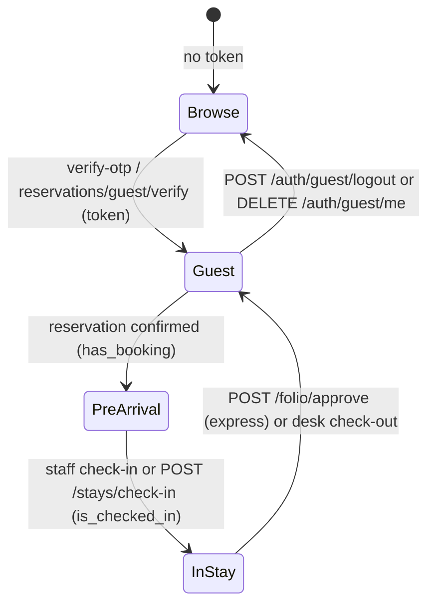
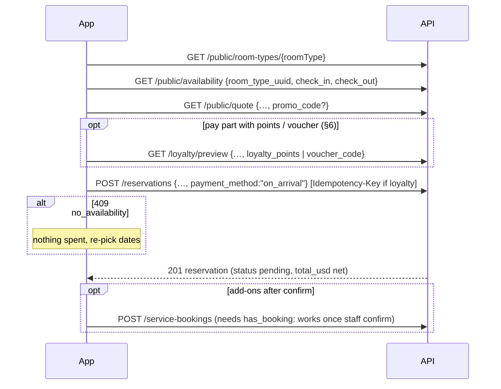
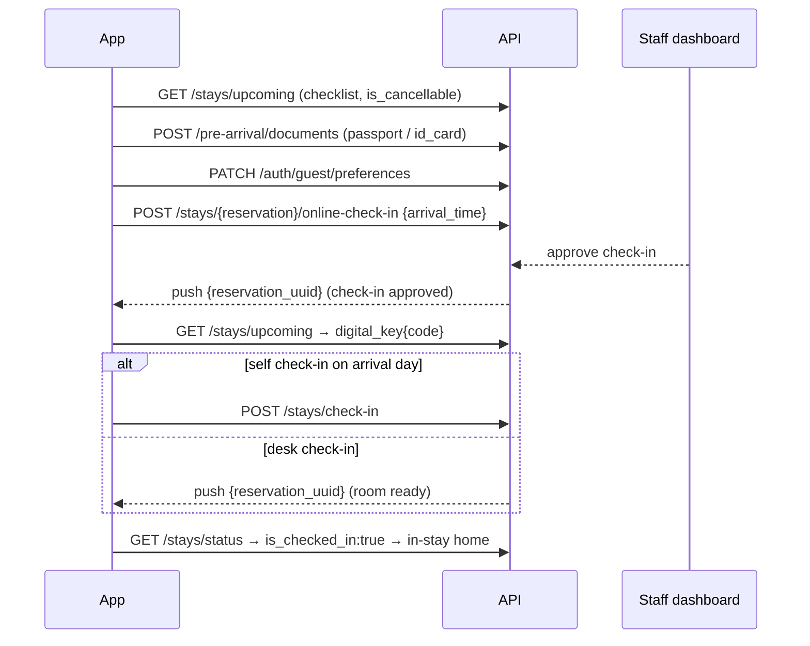
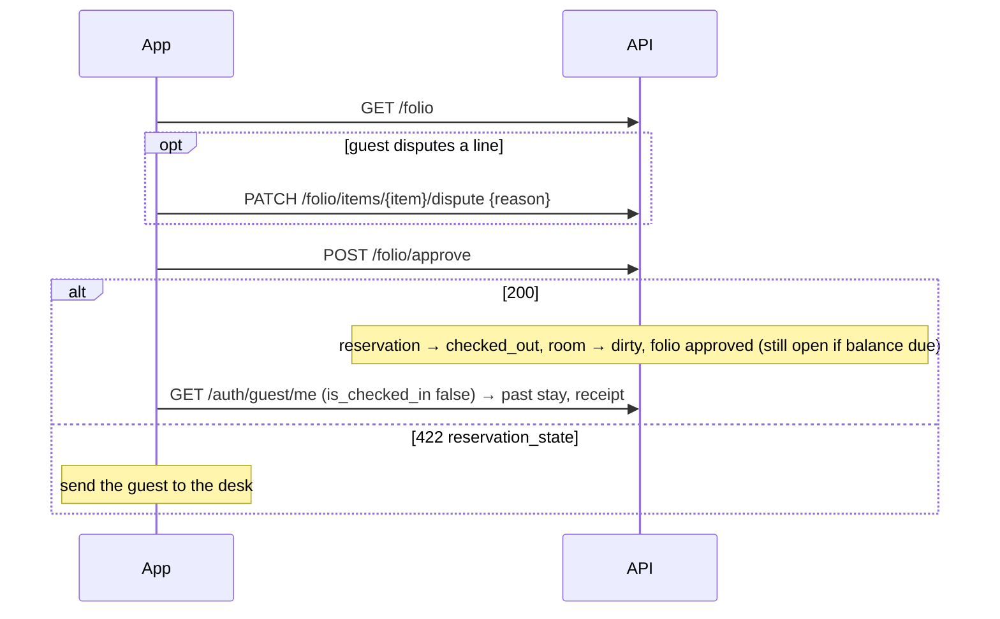

# Carlton Guest App: Mobile Frontend Handoff (API gap closure, Phases 1–10)

**Audience:** the Flutter guest-app developer (`mobile/`) who wires the remaining guest APIs, removes the last mocks and closes the `mob` side of the capability tree (`docs/carlton-tree.html`).
**Status (2026-10-06):** Phases 1–9 and 9.1 are built and tested. Phase 10 (Loyalty) is **built for guests**: all 6 guest routes are live, but the phase is **15/17 plans** executed. The two gap plans 10-16/10-17 (LOY-23, loyalty forfeit on account deletion) are **pending**. See §6.
**Sources:** `backend/docs/API_GUIDE_MOBILE.md` is authoritative for shapes, and `backend/docs/CHANGELOG_MOBILE_API.md` lists what changed per phase. Use this file for orientation, the app-vs-API gaps, flows and the wiring checklist. Every `METHOD /path` below was checked against `php artisan route:list` (`backend/routes/api.php`), and only anonymous or guest (`auth:guests`) routes appear here. App findings come from an audit of `mobile/lib/` on 2026-10-06.
**Try it:**
- Run `php artisan migrate:fresh --seed`, then `php artisan postman:refresh-env`, then import `backend/docs/postman/` (collection + environment). The environment holds a working `guest_token` for **Ahmad Khalil** (checked in, full activity).
- Other seeded guests: Layla Hassan (confirmed, pre-arrival only), Sara Ibrahim (checked out, settled folio), Omar Youssef (cancelled booking), Rania Saad (never OTP-verified, mid soft-hold). Promo codes: `SUMMER10`, `WELCOME20`, and `EXPIRED05` (expired on purpose, for `invalid_promo`).
- **Static OTP:** there is no SMS/WhatsApp/email provider. In `local`/`testing` the OTP is always **`000000`** for every purpose (`login`, `register`, `booking_link`, `booking_verification`). Real random codes are generated everywhere else, and they are not delivered anywhere yet (PROV-01).
- **Loyalty is not seeded.** The program is inactive and the catalogue is empty until a staff user with `loyalty.manage` fills the loyalty settings and rewards in the dashboard. Until then `program` reads `{earning:false, points_discount:false, rewards:true}`.

---

## 1. Quick start

### 1.1 Base URL, headers, auth

| Item | Value |
|---|---|
| Base URL | `https://<host>/api`. **No `/v1`.** All paths below are relative to `/api`. The app already uses `$API_HOST/api` (`api_service.dart`). The project `CLAUDE.md` and some planning notes say `/api/v1`, and the routes do not match that. |
| Auth | Guest OTP (§3.1) → `data.token`, a Sanctum token for the `guests` guard. Send `Authorization: Bearer <token>` on every guest call. A staff token on a guest route is `401`, and a guest token on a staff route (`/cms/*`, `/operations/*` …) is `401`. |
| Headers | `Accept: application/json`, `Content-Type: application/json` (multipart for document and chat uploads), `Accept-Language`, optional `X-Request-Id` |
| Identity | `guest.uuid`. Integer ids are never exposed. Route params are UUIDs, except `{slug}` on pages and journal posts and `{type}` on reviews. |
| Refresh session | `GET /auth/guest/me` on launch and after any check-in/check-out. `GET /stays/status` is the cheaper probe for the two entitlement flags. |
| Token storage | **Use `flutter_secure_storage`.** The app stores the token in plain `GetStorage` today (`get_storage_service.dart`, `StorageKeys.token`). The guide requires secure storage. |

### 1.2 Response envelope

```json
{ "success": true, "message": "Localized text.", "data": { }, "request_id": "uuid" }
```
Paginated `data`: `{ "items": [...], "meta": { "current_page", "last_page", "per_page", "total" } }`.

Error:
```json
{ "success": false, "message": "Localized.", "error_code": "guest_account_deletion_blocked",
  "context": { "reasons": ["open_folio"], "booking_codes": ["CARL-7K2M9QXA"] }, "request_id": "uuid" }
```
Validation (`422 validation_failed`) adds `errors` keyed by field, e.g. `errors.idempotency_key`, `errors.preferences`, `errors.confirm`, `errors.identity`. `context` is `null` when there is none.

Rules:
- **Branch on `error_code`, never on `message`.** Keep a `default:` branch that shows `message`.
- **401 is `unauthorized`.** Resolved from code: the global handler maps every `AuthenticationException` to `error_code: "unauthorized"` (`bootstrap/app.php`), and no code path emits `unauthenticated`. The guide writes `unauthenticated` in several tables, which is a doc typo. The app's `ErrorCodes.unauthorized` is correct.
- Exceptions to the envelope: `GET /stays/{reservation}/receipt/pdf` returns raw `application/pdf` (errors still use the envelope), and `GET /public/dining-venues/{diningVenue}/menu/download` returns **204 with an empty body** when there is no file.
- `405 method_not_allowed` (with an `Allow` header) is returned for a wrong verb on a known path. It used to be a 500 `server_error`.
- Log `request_id` in bug reports.

### 1.3 Pagination

- `page`, `per_page`: default 15, clamped at 100 and never an error. Read the page size you got from `meta.per_page`.
- Unpaginated: `GET /public/service-catalog`, `GET /public/dining-venues/{diningVenue}/menu-categories`, `GET /public/settings`, `GET /public/exchange-rates`, `GET /stays/upcoming` (array), `GET /stays/active` (object or `null`).
- The app's `PaginatedControllerMixin` exists, but service requests and chat read **page 1 only** (tree notes). Wire paging there.
- Filters use `?field=v`, `?field[eq|in|gte|lte]=v`. Unknown params are ignored.

### 1.4 Localization

- `Accept-Language` accepts `en`, `ar`, `fr`, `tr`, `es`. It **only** localizes `message`, validation strings, and derived labels (`label`, `source_label`, `type_label` on loyalty rows).
- Translatable content is a locale map (`{ "en": "…", "ar": "…", "fr": "…" }`). **A locale may be absent.** Pick `field[appLocale]` and fall back to `en`. The app already does this via `Localized`.
- `preferred_locale` (on `me`) is one of the same five. `PUT /auth/guest/profile {preferred_locale}` trims and lower-cases it. `fr-FR`, `de`, `""` and `null` are `422`.
- **App gap:** `settings_service.dart` only sends `preferred_locale` for `en`/`ar` (`_serverLocales = {'en','ar'}`, with a stale comment saying the server stores only those). **Send all five.** The server localizes push text from `preferred_locale`, not from `Accept-Language`, so an `fr`/`tr`/`es` user gets `en`/`ar` pushes today.
- `POST /auth/guest/verify-otp` seeds a **new** guest's `preferred_locale` from `Accept-Language`, so always send the app locale on that call. An existing guest is never changed by the header.
- The guide suggests mirroring `preferred_locale` into the app locale on first login. The app deliberately does not (comment in `middleware_service.dart`). This is a product call. If you keep the app choice authoritative, push it to the server with `PUT /auth/guest/profile`.
- Folio and receipt line `description` is a plain string, so Arabic receipts show English lines.

### 1.5 Idempotency-Key

A request **header**, at most 64 characters. Generate **one UUID per user intent** (one tap on "Redeem" or "Confirm booking with points"), persist it until the call resolves, and resend the same key on every retry of that call. A body field named `idempotency_key` is ignored.

| Route | Header |
|---|---|
| `POST /loyalty/rewards/{reward}/redeem` | **required** (`422 validation_failed`, `errors.idempotency_key`) |
| `POST /reservations` with `loyalty_points` or `voucher_code` | **required** (same 422) |
| `POST /reservations` without loyalty fields | ignored (no replay protection) |
| every other guest write | not accepted |

- **Same key + same input** returns `200` with the original result (same reservation / same voucher). Nothing is written twice.
- **Same key + different input** returns `409 idempotency_conflict` with `context: { idempotency_key }`. That is a client bug: mint a new key only when the guest really changed the input.
- **App gap:** no `Idempotency-Key` is sent anywhere today (grep: not found), and `RetryInterceptor` auto-retries **every method including POST** (max 2, on timeouts, connection errors and 503). A retried plain `POST /reservations`, `POST /service-requests` or `POST /conversations` can create a duplicate. Fix: add the header on the two routes above, and mark other POSTs as no-retry (the interceptor's `_skip_retry` flag) or only retry them on connect errors that never reached the server.

### 1.6 Guest tiers and gating middleware

| Tier | Gate | Routes |
|---|---|---|
| P public | none | `/public/*`, `/health`, OTP routes, `/reservations/guest*`, `POST /event-inquiries` |
| G guest | `auth:guests` | profile, preferences, delete, logout, `/reservations*`, `/stays/*` reads, online and self check-in, chat, device tokens, reviews, `/loyalty/*` |
| A pre-arrival | `auth:guests` + **`EnsureHasBooking`** | `POST /pre-arrival/documents`, `POST /service-bookings`, `POST /dining-venues/{diningVenue}/table-reservations` |
| S in-stay | `auth:guests` + **`EnsureIsCheckedIn`** | `GET /folio`, `POST /folio/approve`, `PATCH /folio/items/{item}/dispute`, `GET /service-requests`, `POST /service-requests`, `POST /transport-requests`, `PATCH /stays/active/dnd` |

- Both middlewares reject with **`403 no_active_reservation`**. That is the single code for "you need to be further along in your stay".
- `has_booking` is true while the guest holds a `confirmed` or `checked_in` reservation whose `check_out` has not passed. `is_checked_in` means a `checked_in` stay. Both come from `GET /auth/guest/me` and `GET /stays/status`, and the same source drives the middleware.
- `has_active_reservation` on `me` is a **deprecated alias** of `has_booking`. Read the two flags instead.
- Ownership is checked inside the request, not by a tier: someone else's reservation, receipt or folio item answers `404 not_found` (never 403), except `POST /stays/{reservation}/online-check-in`, which answers `403 forbidden`.



### 1.7 Throttles

| Route | Limit | UI |
|---|---|---|
| `POST /auth/guest/request-otp` | 10/min per IP (+ OTP limits per contact) | disable resend for 60 s on `429 too_many_requests` |
| `POST /auth/guest/verify-otp` | 5 wrong codes → `429 otp_locked` | back to step 1 |
| `POST /reservations/guest` | OTP limit 1/min, 5/hour per contact | `429 too_many_requests` |
| `DELETE /auth/guest/me` | 5/min per guest | do not auto-retry |
| `GET /loyalty/preview`, `POST /loyalty/rewards/{reward}/redeem` | 30/min | debounce the points field (≥400 ms) |
| `GET /public/exchange-rates` | 60/min, `Cache-Control: public, max-age=300` | fetch on launch and checkout only |

The retry interceptor already skips 429. Keep it that way.

### 1.8 Push (FCM) and Firestore

- Register with `POST /device-tokens {token, platform: ios|android|web}` → `{uuid, platform, last_used_at}`. It is idempotent, so call it after login and whenever the FCM token rotates. Send the same token as `device_token` on `POST /auth/guest/logout` so pushes stop on this device.
- **Pushes carry no `type` key.** Resolved from code: `NotificationService::pushToGuest` stores `type` on the `guest_notifications` row, but `FirebaseService::sendPush` sends only the notification title/body plus the `data` map (values stringified). There is **no guest route that lists notifications**, so the app cannot read the type either. Route on the `data` keys:

| Push | When | FCM `data` | Tap action |
|---|---|---|---|
| welcome | first-ever device registration | `{}` | home |
| room ready | staff check-in, or an in-stay room move (Phase 3: **no longer** on a pre-arrival room assignment) | `{reservation_uuid}` | refresh `GET /stays/status` and open the stay |
| check-in approved (Phase 4) | staff approve the pre-arrival check-in | `{reservation_uuid}` | same. **Never contains the key code**: fetch it from `GET /stays/active` or `/stays/upcoming`. |
| loyalty points expiring (Phase 10) | daily 09:00 hotel time, one per guest per run | `{points, expires_at}` (both strings) | open Loyalty, refresh `GET /loyalty/account` |

  Room ready and check-in approved have the **same** data shape. Handle both as "stay changed, refetch". If product needs to tell them apart, ask backend for an additive `type` key in `data`.
- **App gap:** push is dead at runtime. `Firebase.initializeApp` and `NotificationService` registration are commented out (`main.dart` lines 24, 31, 68). No `google-services.json`, `GoogleService-Info.plist` or `firebase_options.dart` exists. The local channel id is still the CartX leftover `cartx_orders`, and tap routing (`_handleDataNavigation`) is commented CartX code.
- **Firestore:** the guest chat mirrors to the Firestore `chats` collection (one doc per message, keyed by `uuid`, filter `conversation_uuid`). The app has no `cloud_firestore` dependency and polls REST. That works, and the live mirror is optional. Other Firestore collections (`ops_queue`, tickets, housekeeping) are staff-only.
- Delivery needs a backend queue worker. A missing push in a dev environment is usually that.

---

## 2. Breaking and contract changes (read first)

The app was wired (integration plan phases 0–7) against the July guide. Since then the backend added routes and fields, and some app code still runs on mocks or stale assumptions. **No change since July breaks an existing app build.** The rows below are what to fix or adopt.

| # | Area | App today / old | Real API now | Action |
|---|---|---|---|---|
| 1 | **Loyalty screen** | full mock (`loyalty_controller.dart`): tiers, `memberId`, `staysCount`, kinds `earned/redeemed/expired`, sources `dining/spa/other`, redeem CTA is a "coming soon" snackbar. Header comment says the backend has no loyalty routes (now false). | 6 guest routes (§6). No tiers, member id or stay count. `type` `earn\|redeem\|expire\|adjust\|clawback\|refund`, `source` `stay\|service\|manual\|refund\|null`. | rebuild per §6 |
| 2 | **Account deletion** | not implemented (no row, no call) | `DELETE /auth/guest/me {confirm:true}` | build it (Apple 5.1.1(v) requires it). §3.1 |
| 3 | Preferences | saved locally only (`pref_*` in GetStorage). Bed ids include `extra`, pillow lacks `medium`/`hypoallergenic`, no floor. Mattress, smoking, early/late toggles have no server field. | `PATCH /auth/guest/preferences` `{bed_type, pillow_type, floor_preference, other}` | wire it, drop `extra`, add `medium`, `hypoallergenic` and floor. Keep the extra toggles local or put them in `other`. |
| 4 | `preferred_locale` | sent for `en`/`ar` only | `en\|ar\|fr\|tr\|es` | send all five (§1.4) |
| 5 | Exchange rates | hand-maintained `ExchangeRates` table, `isLive: false`, comment "there is no /exchange-rates endpoint" | `GET /public/exchange-rates` | wire it, keep the built-in table as a fallback for `rate: null` or failures, then flip `isLive` |
| 6 | Error codes | `ErrorCodes` defines codes the backend never emits: `business_rule_violation`, `out_of_stock`, `insufficient_balance`, `route_not_found`, `check_in_not_open` | real codes missing in the app: `idempotency_conflict`, `hold_expired`, `guest_account_deletion_blocked`, `online_check_in_closed`, `booking_link_failed`, `folio_item_dispute_open`, `method_not_allowed`, all 7 guest `loyalty_*` codes | add the missing ones, delete the dead ones |
| 7 | 401 code | `unauthorized` | `unauthorized` (the guide's `unauthenticated` is a typo) | no change |
| 8 | Self check-in window | the app relies on the dead `check_in_not_open` code | `POST /stays/check-in` answers `422 reservation_state` unless a `confirmed` stay has `check_in ≤ hotel-today < check_out` | map `reservation_state` on this call to "check-in is not open yet" |
| 9 | Online check-in | never called | `POST /stays/{reservation}/online-check-in {arrival_time}` | decide: keep the self-check-in wizard, add arrival-time submission, or both (§3.4) |
| 10 | POST retries | retried with no idempotency | §1.5 | add the header, stop blind POST retries |
| 11 | Token storage | plain GetStorage | secure storage | switch to `flutter_secure_storage` and migrate the stored token once |
| 12 | Push | not started, CartX leftovers | 4 push kinds, `data` without `type` (§1.8) | init Firebase, register the token, route on `data` keys |
| 13 | Sign out | `POST /auth/guest/logout {device_token}` then local wipe | same | no change. Also wipe on 401. |
| 14 | Express checkout | `POST /folio/approve` | now runs the real desk check-out (room turns dirty). `422 reservation_state` when the guest's most recent booking is not the checked-in stay. It never returns `folio_unsettled` (§3.5). | add the `reservation_state` branch |
| 15 | Folio shape | items `{uuid, description, amount_usd, source_type}` | + `payments[]`, `paid_usd`, signed `balance_due_usd`, `open_disputes_count`, item `quantity, unit_price_usd, posted_by, posted_at, reason, reverses_item_uuid, dispute`. Item uuids are now **stable**. Desk charges (`manual`) and negative `credit` lines appear. | parse the new fields. Key list rows on `uuid`. |
| 16 | Line-item dispute | not wired (`folio_controller.dart` only reads) | `PATCH /folio/items/{item}/dispute {reason}` | add a "Dispute this charge" action |
| 17 | DND | switch starts `false` and is reset to `false`. `ActiveStay.dndEnabled` is parsed but unused. | `GET /stays/active` returns `dnd{enabled, until}` | bind the switch to the server value |
| 18 | Past-stay badge | `CustomPastStayCard` hard-codes COMPLETED, even for cancelled | `status` is raw `checked_out\|cancelled` | label by `status` |
| 19 | Table reservation time | `scheduled_at` was the local wall time stored as UTC (3 h late) | true UTC instant. `date`/`time` are hotel-local (Asia/Damascus). Old rows are not migrated. | convert `scheduled_at` to the device zone |
| 20 | Menu download | button stubbed | `GET /public/dining-venues/{diningVenue}/menu/download` | open `data.url` externally. 204 = no menu, do not JSON-decode. |
| 21 | Quick-request chips | tiles matched by code against old demo data | catalog `kind: direct` categories now include `late_checkout` and `luggage` (unpriced). Post `default_item_uuid`. | build chips from the catalog. Unknown `icon` → default icon. |
| 22 | Cancel booking | `DELETE /reservations/{reservation}` 204 | same, and it also refunds points, restores a used voucher and claws back earned points | refetch loyalty after a cancel |
| 23 | Room-ready push | fired on pre-arrival room assignment | fires only on staff check-in and in-stay room moves | do not show "room ready" before check-in |
| 24 | Link booking code | the tree notes `verify-otp` with `booking_link` failing when no phone/email is sent | `verify-otp` requires `phone` or `email` (`422 validation_failed`, `errors.identity`). `booking_code` is optional there. | always send the contact (§3.1) |
| 25 | `mobile/CLAUDE.md` | says "No backend is wired up yet", `constants/demo_data.dart`, `SessionService` fake booleans, `/user/check-token` | none of that exists. The app calls `GET /auth/guest/me` and phases 0–7 are wired. | rewrite it so agents stop following it |
| 26 | Public content not in the guide index | – | 10 public routes exist but are missing from the guide's 70-row index (§3.10) | treat them as supported (they are in `route:list`) |

---

## 3. Modules (tree order)

Notation: tier **P/G/A/S** (§1.6). Error rows list `code (HTTP) {context}` and the UI action. `401 unauthorized`, `404 not_found`, `422 validation_failed` and `429 too_many_requests` apply everywhere and are omitted unless they need special handling.

### 3.1 Access & identity

| Endpoint | Tier | Body | Response |
|---|---|---|---|
| `POST /auth/guest/request-otp` | P, 10/min | `{channel: sms\|whatsapp\|email, phone\|email, purpose: login\|register}` | `{identifier, channel, expires_in}` (no code) |
| `POST /auth/guest/verify-otp` | P | `{phone\|email, code (6), purpose: login\|register\|booking_link, booking_code?}` | `{token, guest{uuid, phone, phone_country, phone_verified, email, email_verified, first_name, last_name, preferred_locale}}` |
| `POST /auth/guest/link-booking-code` | P | `{booking_code (CARL-XXXXXXXX), last_name\|phone}` | `{message, masked_contact}`. The OTP goes to the reservation's contact. |
| `GET /auth/guest/me` | G | – | guest + `preferences`, `has_booking`, `is_checked_in`, `has_active_reservation` (deprecated), `active_reservation{uuid, booking_code, status, check_in, check_out}\|null` |
| `PUT /auth/guest/profile` | G | any of `{first_name, last_name, phone, email, preferred_locale}` | full guest (same shape as `me`) |
| `PATCH /auth/guest/preferences` | G | any of `{bed_type, pillow_type, floor_preference, other}` (PATCH semantics) | `{bed_type, pillow_type, floor_preference, other, updated_at}` |
| `DELETE /auth/guest/me` | G, 5/min | `{confirm: true}` | `data: null`. **All tokens on every device are revoked.** |
| `POST /auth/guest/logout` | G | `{device_token?}` (≤500) | `data: null`. Only this token is revoked. |

Preferences enums: `bed_type` `king|queen|double|twin|single` (**`extra` is refused**), `pillow_type` `soft|medium|firm|feather|hypoallergenic`, `floor_preference` `low|high|any`, `other` ≤500. A present key is written, `null` clears it, an absent key is left alone. A body with none of the four → `422`, `errors.preferences`.

| Code | Context | UI |
|---|---|---|
| `identity_required` (422) | – | request-otp: "Enter your phone or email" |
| `otp_expired` (422) | – | "Code expired", clear input, offer resend |
| `otp_invalid` (422) | – | "Incorrect code", allow retry |
| `otp_locked` (429) | – | "Too many attempts", back to step 1 |
| `booking_link_failed` (404) | – | generic "Reservation not found". Never reveal whether the code alone matched. |
| `verified_contact_immutable` (409) | – | profile: a verified phone/email cannot be replaced here. Route through request-otp/verify-otp. |
| `guest_account_deletion_blocked` (422) | `{reasons[], booking_codes[≤10]}` | show the front-desk message and the codes (below) |
| `unauthorized` (401) on logout | – | already signed out, wipe locally anyway |

**Sign-in flows**

```mermaid
sequenceDiagram
    participant App
    participant API
    alt Path A: new or returning guest
        App->>API: POST /auth/guest/request-otp {channel, phone|email, purpose}
        App->>API: POST /auth/guest/verify-otp {phone|email, code, purpose} + Accept-Language
    else Path B/C: existing booking (website, desk, OTA)
        App->>API: POST /auth/guest/link-booking-code {booking_code, phone}
        API-->>App: {masked_contact}
        App->>API: POST /auth/guest/verify-otp {phone|email, code, purpose:"booking_link", booking_code}
    end
    API-->>App: {token, guest}
    Note over App: store token in secure storage; first_name null → create-profile screen
    App->>API: GET /auth/guest/me (has_booking, is_checked_in)
    App->>API: POST /device-tokens {token, platform}
```
`verify-otp` must carry the contact the OTP was sent to. `masked_contact` is masked, so for Path B ask for the **phone** as the second factor and reuse it. If the guest linked with `last_name` only, ask them for the full phone or email on the OTP screen. (Verify on a device: the tree flags this flow as failing in the current build.)

**Account deletion (tree: `mob` false)**

What the server does:
- **Erased:** names, phone, email, preferences, tokens, device push tokens, in-app notifications, staff notes, OTP rows, the guest's chat text and attachments (including the Firestore copies), and ID documents of stays that were not completed.
- **Kept:** reservations (booking code, last name), folios, payments, disputes, service bookings and requests, tickets, event inquiries, and reviews (shown without a name).
- Signing in again with the same phone or email creates a **new** account. The old stays are not visible to it and cannot be re-linked.

`reasons` is any subset of `active_reservation`, `open_folio` (for example after express check-out, until staff settle), and `upcoming_service_booking`, always in that order.

> **Loyalty forfeit is pending (LOY-23, plans 10-16/10-17, not shipped).** Today a deleted account keeps its points batches and unspent vouchers until they expire normally. The guest cannot see them anyway, because every token is revoked. Once the plans ship, deletion will **forfeit every point and close every unspent voucher, irreversibly**. Build the confirmation dialog for that behaviour now: fetch `GET /loyalty/account` and `GET /loyalty/vouchers?status=active`, then show "You will lose N points and M vouchers". There is no contract change to wait for.

```mermaid
sequenceDiagram
    participant App
    participant API
    App->>API: GET /loyalty/account, GET /loyalty/vouchers?status=active
    Note over App: confirm dialog: what is erased vs kept, points and vouchers lost (pending LOY-23)
    App->>API: DELETE /auth/guest/me {confirm:true}
    alt 200
        Note over App: wipe token, guest JSON, fcmToken, preferences; go to sign-in
    else 422 guest_account_deletion_blocked {reasons, booking_codes}
        Note over App: "Contact the front desk" + list booking_codes
    else 401
        Note over App: already deleted or signed out: wipe locally
    end
```
On 200, reuse `MiddlewareService.signOut(revokeRemotely: false)`. The token is already dead, so do not call logout.

### 3.2 Rooms & inventory (public)

| Endpoint | Tier | Notes |
|---|---|---|
| `GET /public/room-types`, `GET /public/room-types/{roomType}` | P | `name`, `description` (maps), `banner`, `images[]`, `base_price_usd`, `size_sqm`, `view_type`, `bed_types[]` (may include `extra`), `rating`/`rating_count`, `highlights[4]`, `amenities[{uuid, slug, name, icon, sort_order}]`, `cancellation_hours` |
| `GET /public/rooms`, `GET /public/rooms/{room}` | P | rooms. `status` is the **housekeeping** state (`available\|dirty\|maintenance`) since Phase 2, not occupancy. Do not use it for booking. |
| `GET /public/amenities` | P | amenity list. `icon` is a stable key (`balcony`, `jacuzzi`, …), never a URL. |
| `GET /public/availability` | P | `room_type_uuid, check_in, check_out` → `{room_type_uuid, check_in, check_out, available, rooms_available}` |
| `GET /public/exchange-rates` | P, 60/min | `{base:"USD", stale_after_hours, rates[{currency, rate, display_decimals, updated_at, is_stale}]}` |

Exchange rates:
- `rate` is the number of units of the currency per 1 USD, as a **6-decimal string**, or `null` when never set. Parse it as a decimal.
- Display value = `usd × rate`, rounded to `display_decimals`. This is display-only, and every payment stays USD.
- The board is empty until staff enter the first rates. Keep the fallback, and show "rates as of {updated_at}" when `is_stale`.

### 3.3 Reservations

| Endpoint | Tier | Body / params | Response / notes |
|---|---|---|---|
| `GET /public/quote` | P | `room_type_uuid, check_in, check_out, promo_code?` | `{daily_rate_usd, nights, subtotal_usd, discount_usd, total_usd, promo_code_id, rules_applied}`. **JSON numbers here**, not strings. No taxes. |
| `POST /reservations` | G | `{room_type_uuid, check_in, check_out, payment_method: cash\|on_arrival, promo_code?, loyalty_points? \| voucher_code?}` + `Idempotency-Key` when a loyalty field is sent | 201 reservation `{uuid, booking_code, status:"pending", check_in, check_out, nights, source, payment_method, total_usd (net), hold_expires_at, loyalty}`. 200 on replay. |
| `GET /reservations` | G | page | own reservations, newest first, same shape + nested `guest{…, preferences}` |
| `GET /reservations/{reservation}` | G | – | one reservation. Someone else's → 404. |
| `DELETE /reservations/{reservation}` | G | – | 204. Allowed from `pending_verification\|pending\|confirmed`. Reverses loyalty (§6). |
| `POST /reservations/guest` | P | `{room_type_uuid, check_in, check_out, first_name, last_name, phone\|email, payment_method?, promo_code?}` | `{reservation_uuid, identifier_masked, channel}`. Soft-holds a room for 5 min and sends an OTP. |
| `POST /reservations/guest/verify` | P | `{reservation_uuid, phone\|email, otp_code}` | `{reservation, guest, token}`. **Keep the token**: the guest is now signed in. |

- The app books only with `on_arrival`, and blocks card, Apple Pay and Google Pay client-side. That is correct: there is no gateway (§5).
- The tree notes "app books without checking" availability. The booking flow does call `GET /public/availability` per room type, but `POST /reservations` is the only real check: handle `409 no_availability` on it.
- Website and desk bookings never apply loyalty. `POST /reservations/guest` takes no loyalty fields.

| Code | Context | UI |
|---|---|---|
| `no_availability` (409) | – | "No longer available". Nothing was spent. Re-pick dates. |
| `invalid_promo` (422) | – | clear the promo field |
| `reservation_state` (422) | – | cancel: too late (checked in) or already cancelled. Refresh. |
| `hold_expired` (422) | – | guest/verify: 5 minutes passed, restart step 1 |
| `otp_invalid` / `otp_expired` / `otp_locked` | – | as in §3.1. `otp_expired` also drops the hold. |
| `idempotency_conflict` (409) | `{idempotency_key}` | client bug: a new body was sent under an old key |
| `loyalty_*` (422) | §6 | §6 |


Status lifecycle: `pending_verification → pending → confirmed → checked_in → checked_out`, plus `cancelled`. An app booking starts at `pending`, and **tier A opens only at `confirmed`** (staff confirm it). Add-on bookings right after `POST /reservations` will therefore get `403 no_active_reservation` until then: queue them or tell the guest.

### 3.4 Stay & check-in

| Endpoint | Tier | Notes |
|---|---|---|
| `GET /stays/status` | G | `{has_booking, is_checked_in, reservation{uuid, booking_code, status, check_in, check_out, checked_in_at, nights_remaining, room_number, online_check_in, digital_key, pre_arrival_checklist}\|null}`. Not gated: `false`/`null` is a valid answer. |
| `GET /stays/active` | G | object or `null`: `room_number, room_name (map), checked_in_at, check_in, check_out, nights, nights_remaining, dnd{enabled, until}, folio_total_usd, online_check_in, digital_key, pre_arrival_checklist` |
| `GET /stays/upcoming` | G | array, soonest first: `booking_code, room_number, room_name, price_usd, check_in, check_out, nights, is_cancellable` + the three Phase 4 blocks. Excludes `pending_verification`. |
| `GET /stays/past` | G | paginated: `room_name, total_nights, check_in, check_out, checked_out_at, total_charge_usd, status (checked_out\|cancelled), has_receipt, room_type_uuid` |
| `GET /stays/{reservation}/receipt` | G | `{reservation{…, guest_name}, folio{uuid, status, subtotal_usd, total_usd, approved_by_guest_at, settled_at}, items[{description, amount_usd, source_type}], payments[], balance_due_usd}`. `balance_due_usd` is a **number** here and a string on `GET /folio`. |
| `GET /stays/{reservation}/receipt/pdf` | G | raw PDF (`Content-Disposition: attachment`). Labels follow `Accept-Language`. |
| `PATCH /stays/active/dnd` | S | `{enabled, until?}` → `{enabled, until}`. Enabling without `until` lasts until the end of the hotel day. |
| `POST /stays/{reservation}/online-check-in` | G | `{arrival_time: "HH:mm"}` (strict `H:i`, hotel-local) → the upcoming-item shape, 200 on every submit |
| `POST /stays/check-in` | G | **self check-in**, no body. Checks the guest into the earliest `confirmed` stay with `check_in ≤ hotel-today < check_out`, through the same action the desk uses. Returns the active stay. Idempotent: a guest who is already in-house gets the active stay back. **Not in the guide** (the app's wizard uses it). |
| `POST /pre-arrival/documents` | A | multipart `documents[i][type]` (free string ≤255: `passport`, `id_card`, `visa`) + `documents[i][file]` (jpg/jpeg/png/pdf ≤10 MB) → 201 `[{uuid, type}]`. No URL is returned. (Re)opens a pending check-in approval. |

- Phase 4 blocks on stay payloads:
  - `online_check_in{arrival_time, submitted_at, approval_status}`.
  - `digital_key{code, issued_at, expires_at}|null`.
  - `pre_arrival_checklist{complete, items[6]}`, with item keys `documents_uploaded, check_in_approved, preferences_set, arrival_time_set, room_assigned, digital_key_issued`.
- **`digital_key.code` (`XXXX-XXXX-XXXX`) is display-only and not lock-grade.** Never cache, log or screenshot-share it. The three stay reads send `Cache-Control: no-store, private`. Exclude them from any HTTP cache and from `PrettyDioLogger` bodies.
- `checked_in_at` is `null` on old stays, so fall back to `check_in`. Past `status` has no `complete` value: label `checked_out` "Completed" and `cancelled` "Cancelled".
- ID scan = the same documents route with `type: id_card`. There is no OCR.
- `preferences_set` on the checklist only turns true when preferences are saved **on the server** (§2 row 3).

| Code | Context | UI |
|---|---|---|
| `no_active_reservation` (403) | – | tier gate: hide the action or explain "available after booking / check-in" |
| `reservation_state` (422) on online-check-in | `{status, allowed:["confirmed"]}` | the booking is not confirmed yet |
| `online_check_in_closed` (422) | `{check_in, today}` | the arrival day has passed, so go to the desk |
| `forbidden` (403) on online-check-in | – | not this guest's reservation |
| `reservation_state` (422) on `POST /stays/check-in` | – | "Check-in opens on your arrival day once the hotel confirms your booking" |

**Pre-arrival → in-stay**



### 3.5 Folio & payments

| Endpoint | Tier | Body | Response |
|---|---|---|---|
| `GET /folio` | S | – | folio `{uuid, status (open\|settled), subtotal_usd, total_usd, approved_by_guest_at, settled_at, items[], payments[], paid_usd, balance_due_usd, open_disputes_count}` |
| `PATCH /folio/items/{item}/dispute` | S | `{reason ≤500}` | the item with `dispute{uuid, status:"open", reason, raised_by:"guest", raised_at, resolved_at, resolution_note}` |
| `POST /folio/approve` | S | – | folio with `approved_by_guest_at`. **Also checks the stay out.** |

Item: `{uuid, description, amount_usd, source_type (reservation|service_booking|service_request|manual|credit), quantity, unit_price_usd, posted_by{uuid,name}|null, posted_at, reason, reverses_item_uuid, dispute|null}`. Payment: `{uuid, method, amount_usd, status, note, created_at}`.
- Money is a 2-decimal **string**. `balance_due_usd` is signed: negative means the hotel owes the guest (refunds happen at the desk).
- The folio is reconciled on every GET until `settled`, then frozen. Item uuids are stable between calls.
- Disputes never change amounts and never block check-out. If the hotel agrees, it adds a `credit` line. After a decision (`resolved|rejected`) the guest may dispute again. Disputes work on open and settled folios.

| Code | Context | UI |
|---|---|---|
| `folio_item_dispute_open` (422) | `{item_uuid, dispute_uuid}` | "Already under review" |
| `not_found` (404) | – | not this guest's item, refresh the folio |
| `reservation_state` (422) on approve | – | the most recent booking is not the checked-in stay. Show "please check out at the desk". |
| `no_active_reservation` (403) | – | not in-house (already checked out?), refresh `GET /stays/status` |

**`folio_unsettled` is not reachable from the app** (resolved from code). `ApproveFolioAction` checks out in `GUEST_EXPRESS` mode, which never returns that refusal and is not guarded by the balance. Express check-out with a balance due leaves the folio **open** until staff settle it, and an open folio blocks account deletion (`open_folio`).


Payment is `cash` or `on_arrival` at the desk. The app takes no payment (§5).

### 3.6 Dining

| Endpoint | Tier | Notes |
|---|---|---|
| `GET /public/dining-venues`, `GET /public/dining-venues/{diningVenue}` | P | `name, description, banner, images, cuisine_type, hours, location, rating, rating_count` |
| `GET /public/dining-venues/{diningVenue}/menu-categories` | P | chips `[{uuid, slug, name, sort_order}]`, unpaginated |
| `GET /public/dining-venues/{diningVenue}/menu` | P | `?type={slug}`, paginated `{uuid, type, name, description, price_usd, is_vegan, photo}` |
| `GET /public/dining-venues/{diningVenue}/tables` | P | tables (only for `bookable_type: restaurant_table` via service-bookings, which the app does not need) |
| `GET /public/dining-venues/{diningVenue}/menu/download` | P | 200 `{url, file_name, mime_type, size, updated_at}`. **204 empty body, no envelope** = no file. 404 = unknown or inactive venue. Open `url` externally. |
| `POST /dining-venues/{diningVenue}/table-reservations` | A | `{date (Y-m-d, hotel-local, today+), time (H:i hotel-local), guest_count 1–20, special_request?}` → 201 service booking `{uuid, bookable_type:"restaurant_table", bookable{uuid,label}, scheduled_at (UTC), status, notes, guest_count}` |

- The server picks the smallest free table for a 2-hour seating. Errors: `no_availability` (409, nothing free for that slot) and `no_active_reservation` (403).
- The app's time slots are hard-coded (tree). There is no slot endpoint, so keep them.
- Dining about and gallery copy is still static in the app. `GET /public/dining-venues/{diningVenue}` has `description` and `images`.

### 3.7 Guest services

| Endpoint | Tier | Body | Response |
|---|---|---|---|
| `GET /public/service-catalog` | P | – | array of categories `{uuid, code, kind, name, description, icon, link_target, default_item_uuid, department, sort_order, is_active, items[{uuid, name, description, expected_minutes, price_usd}]}` |
| `POST /service-requests` | S | `{service_item_uuid}` (preferred) **or** legacy `{type}`, plus `priority? (low\|normal\|high)`, `notes? ≤1000` | 201 `{uuid, type, department, status, priority, notes, created_at, category_code, service_item}` |
| `GET /service-requests` | S | page | own requests, newest first. **Page through it** (the app reads page 1 only). |
| `GET /public/spa-services`, `GET /public/pool-cabanas`, `GET /public/transfers` | P | – | bookables |
| `POST /service-bookings` | A | `{bookable_type: spa_service\|restaurant_table\|pool_cabana\|transfer, bookable_uuid, scheduled_at (future), notes?}` | 201 `{uuid, bookable_type, bookable{uuid,label}, scheduled_at, status, notes}` |
| `POST /transport-requests` | S | `{notes?}` | service request `type:"transport"`. **Legacy**: prefer the `transport` chip. |

Switch on `kind`:

| `kind` | Categories | App |
|---|---|---|
| `catalog` | room service, housekeeping, laundry | list `items`, post the chosen `service_item_uuid` |
| `direct` | concierge, transport, maintenance, **late_checkout**, **luggage** | quick-request chip: post `default_item_uuid` (+ notes). `items` is empty. |
| `link` | restaurant | navigate by `link_target` (`dining`) |
| `toggle` | do not disturb | switch bound to `PATCH /stays/active/dnd` |
| unknown | – | hide |

- Request `status`: `new|in_progress|completed|cancelled`. Booking `status`: `pending|confirmed|cancelled|completed`.
- An item with a non-null `price_usd` bills the folio. `late_checkout` and `luggage` are free, and a granted late checkout does **not** move `check_out`.
- `expected_minutes` is an integer or `null`. Format it yourself.
- Errors: `no_active_reservation` (403) and `validation_failed` (neither field sent, or an unknown or inactive item).

### 3.8 Guests & messaging

**Chat (tier G):**
- `GET /conversations` returns your conversations (in practice one).
- `GET /conversations/{conversation}/messages` is paginated, **oldest first**.
- `POST /conversations` sends a message: json `{body}` or multipart `{body?, attachment?}` (image ≤5 MB, at least one of the two). It opens a conversation on the first message and reuses it while open.
- Message shape: `{uuid, sender_type: guest|staff, body, attachment_url, created_at}`.
- Live updates come from Firestore `chats` (optional, §1.8). The app polls REST and reads page 1 only. Staff answers arrive as `sender_type: staff`. Support-ticket replies are internal notes and never reach the guest (TICKET-08 deferred).
- The AI concierge tab stays a stub (P11 not built).

**Push:** §1.8. `POST /device-tokens` is ready, and the app's `NotificationService` is written but not started.

**Reviews:**
- `GET /public/reviews/{type}/{uuid}` (P) is paginated, newest first. `{type}` is `room_type` or `dining_venue`.
- `POST /reviews/{type}/{uuid}` (G) takes `{rating 1–5, comment?}`. It returns 201 the first time and 200 on later calls (it edits your review).
- Review shape: `{uuid, rating, comment, is_verified_stay, created_at, author{first_name,last_name}}`.

**Loyalty:** §6.

### 3.9 Events

- `GET /public/event-spaces`, `GET /public/event-spaces/{eventSpace}` (P). `amenities` is a translatable **string** map, not the room-type amenity objects.
- `POST /event-inquiries` (P, a token is optional and links the inquiry to the guest): `{name, email, phone?, company?, event_type: wedding|corporate|conference|gala|birthday|product_launch|other, event_date? (after today), expected_guests?, budget_usd?, notes? ≤5000, requirements?[{type, notes}]}` → 201 `{uuid, …, status:"new", department}`. Fire-and-forget: the guest sees no status afterwards. Not built in the app (dropped from the integration plan).

### 3.10 Content & site

All public, read-only, paginated (15) unless noted. `is_active=false` records 404. Every type except pages carries `images[{uuid, url, file_name, sort_order}]`, and `banner` is the first image or `null`.

| Endpoint | In the guide index | Notes |
|---|---|---|
| `GET /health` | yes | `{status, time}` |
| `GET /public/home-sliders` | yes | `photo, header_text, location, description_text`. Fetched by the app but not shown (the hero is a video). |
| `GET /public/facilities`, `GET /public/facilities/{facility}` | yes | |
| `GET /public/promotions`, `GET /public/promotions/{promotion}` | yes | `title, description, banner, secondary_description`. The app reads the first page only. |
| `GET /public/pages/{slug}` | yes | legal / help pages (the app uses it) |
| `GET /public/experiences`, `GET /public/experiences/{experience}` | **no** | used by Home and Discover |
| `GET /public/faqs` | **no** | used by Support |
| `GET /public/settings` | **no** | grouped site settings, unpaginated (concierge phone, `site.is_coming_soon`) |
| `GET /public/gallery`, `GET /public/gallery-categories` | **no** | gallery items / categories |
| `GET /public/journal`, `GET /public/journal/{slug}` | **no** | journal posts by slug |
| `GET /public/testimonials` | **no** | testimonials |

The routes marked **no**, plus `GET /public/dining-venues/{diningVenue}/menu/download` (documented in a section but missing from the index), are the **10 public guest-facing routes missing from the guide's endpoint index**, despite the index saying "anything not on this list is dashboard-only". They are anonymous routes in `route:list` and safe to use. The guide does not document their field lists: read the resource or a seeded response before you model them. `POST /auth/login` is also anonymous and also unlisted, but it is the **staff** login and is not for the app. `POST /stays/check-in` is the one undocumented **guest** route (§3.4).

---

## 4. Tree completion checklist (mobile side)

`mob` is the status in `docs/carlton-tree.html` (footer dated 2026-09-23, so some values are stale). For each row: wire the endpoints, then ask backend to flip `mob`. Every node listed has `api: true` unless noted.

| Tree node (section) | mob now | Wire | Not provided / stays mock |
|---|---|---|---|
| guest OTP login / register (Access) | true | done. Add the missing error codes (§2 row 6). | SMS/WhatsApp/email delivery (static OTP) |
| link booking code | partial | `POST /auth/guest/link-booking-code` then `POST /auth/guest/verify-otp` **with phone/email** | – |
| guest profile | true | `PUT /auth/guest/profile`, plus all 5 `preferred_locale` values | – |
| guest account deletion | **false** | `DELETE /auth/guest/me` (§3.1), with the loyalty warning | loyalty forfeit (pending LOY-23) |
| guest sign out | true | `POST /auth/guest/logout {device_token}` | – |
| room types for guests (Rooms) | true | – | – |
| public rooms, amenities | false | `GET /public/rooms`, `GET /public/amenities` (if a screen needs them) | room occupancy |
| availability check | false (stale: the app calls it) | `GET /public/availability`. Also handle `no_availability` on booking. | – |
| exchange rates | false | `GET /public/exchange-rates` | live FX, SYP/TRY payment |
| guest booking flow (Reservations) | partial | `POST /reservations` (+ loyalty, §6) | add-ons in one call, guest details, party size |
| quote, promo code | true | – | taxes |
| cancel my reservation | true | refetch loyalty afterwards | – |
| my reservations list | false | `GET /reservations` (needed to show the `loyalty` block per booking) | – (the app uses `/stays/*` today) |
| book without account | false | `POST /reservations/guest`, `POST /reservations/guest/verify` (optional for the app) | – |
| active, upcoming, past stays (Stay) | true | fix the past-stay badge | – |
| receipt, PDF | true | open/share the PDF (no `open_filex`/`share_plus` yet) | translated line descriptions |
| do not disturb | true | hydrate from `dnd.enabled` | – |
| stay status, entitlements | false | `GET /stays/status` on resume | – |
| pre-arrival documents | true | – | document preview / URL |
| online check-in | mock | `POST /stays/{reservation}/online-check-in`, show `digital_key` | lock-grade key, door unlock |
| ID scan | mock | `POST /pre-arrival/documents` with `type: id_card` | OCR |
| guest preferences | mock | `PATCH /auth/guest/preferences` | mattress, smoking, early/late toggles |
| my bill (Folio) | true | new fields, `PATCH /folio/items/{item}/dispute` | in-app payment |
| approve folio, express checkout | true | `reservation_state` branch | – |
| payment gateway | partial (api partial) | – | **card, Apple Pay, Google Pay (PROV-02 v2)** |
| venues & menus (Dining) | true | – | – |
| reserve a table | partial | – | slot availability endpoint |
| bookable tables | false | `GET /public/dining-venues/{diningVenue}/tables` (only if you book specific tables) | – |
| download menu | mock | `GET /public/dining-venues/{diningVenue}/menu/download` | – |
| service catalog (Services) | partial | build tiles from `kind` (drop the demo-data matching) | – |
| place, track requests | partial | paginate `GET /service-requests` | push on status change (not built) |
| quick requests | mock | `direct` chips → `POST /service-requests {service_item_uuid: default_item_uuid}` | – |
| spa, cabana, transfer booking | false (stale: wired in booking add-ons and the transfer sheet) | `POST /service-bookings` + public lists | cancel or modify a service booking |
| transport request | false | prefer the `transport` chip. `POST /transport-requests` is legacy. | – |
| concierge chat (guest) (Messaging) | partial | paginate, optional Firestore `chats` | agent persona/name |
| AI concierge | mock (api false) | – | **P11 not built** |
| push notifications | false | init Firebase, `POST /device-tokens`, route on `data` (§1.8) | order/ticket status pushes, notification inbox, `type` key in data |
| reviews | true | – | – |
| loyalty (guest) | mock | §6 (6 routes + booking) | tiers, member id, stay count, forfeit on deletion (pending) |
| home sliders (Content) | false | `GET /public/home-sliders` (already fetched; build the slider or drop the call) | – |
| experiences | false (stale: wired) | – | – |
| facilities, promotions | false (promotions wired in Discover) | `GET /public/facilities` | – |
| FAQs, pages | false (stale: wired in Support/Legal) | – | – |
| site settings | false | `GET /public/settings` (coming-soon gate, contact numbers) | – |
| AR / EN localisation | true | all five locales on `preferred_locale` | server-side translation of folio lines |

After wiring, the backend team flips `mob` in the tree. Send them the list of nodes you completed, including the stale ones marked above.

---

## 5. Deferred / not available

| Item | Status | App impact |
|---|---|---|
| SMS / WhatsApp / email OTP (PROV-01) | v2. OTP is static `000000` in local/testing, and not delivered in production. | keep the dev hint out of release builds |
| Online payment gateway (PROV-02) | v2. Only `cash`/`on_arrival`. | keep card/wallet disabled |
| AI concierge / chatbot (P11, AI-01) | not built | keep the "coming soon" tab |
| Guest-visible ticket replies (TICKET-08) | deferred | staff answer in chat only |
| Service-request / ticket status pushes | not built | poll `GET /service-requests` |
| Guest notification inbox | no route | the app cannot list past pushes |
| Lock-grade digital key | not built | `digital_key.code` is display-only |
| Late checkout moving `check_out` | not built | the request is a note to the desk |
| Refunds, service-booking cancel/modify by guest | not built | desk only |
| Translatable folio lines | not built | receipts show the recorded language |
| Loyalty tiers, member id, stay count | not planned | remove them from the UI |
| Loyalty forfeit on account deletion (LOY-23) | **pending** (plans 10-16/10-17) | warn in the delete dialog now |

---

## 6. Phase 10: Loyalty Points Program (BUILT for guests; phase 15/17, LOY-23 pending)

Full contract: `backend/docs/API_GUIDE_MOBILE.md` → *Module: Loyalty*. All six routes are tier **G** (guest token; a staff token or no token is 401). No route takes a guest id, because the guest is the token's owner. There is no 403. No breaking change.

### 6.1 Endpoints

| Endpoint | Throttle | Params / headers | Response |
|---|---|---|---|
| `GET /loyalty/account` | – | – | `{available_points, expiring_soon_points, expiring_soon_window_days, next_expiry_at, lifetime_earned_points, lifetime_redeemed_points, program{earning, points_discount, rewards}, redeem_value_usd, min_redeem_points, max_redeem_percent}`. Always 200. |
| `GET /loyalty/ledger` | – | `type`, `source` (eq/in), `occurred_at` (gte/lte), `points` (gte/lte, integer), `per_page` | paginated, newest first: `{uuid, type, label, source, source_label, points (signed), shortfall_points, discount_usd, occurred_at, expires_at, reservation{uuid, booking_code}\|null, folio, voucher}` |
| `GET /loyalty/rewards` | – | `page`, `per_page` | active catalogue: `{uuid, name (map), description (map\|null), type, type_label, points_cost, discount_usd, voucher_valid_days, is_active, sort_order, created_at, updated_at, deleted_at}` |
| `POST /loyalty/rewards/{reward}/redeem` | 30/min | **`Idempotency-Key` required**, no body | 201 voucher (200 on replay): `{uuid, code (LOY-XXXXXXXX), type, type_label, reward_name (map), value_usd, points_spent, status, expires_at, used_at, reservation}` |
| `GET /loyalty/vouchers` | – | `status`, `type` (eq/in), `points_spent` (gte/lte), `sort=created_at\|expires_at` | paginated vouchers, newest first |
| `GET /loyalty/preview` | 30/min | `room_type_uuid, check_in, check_out, promo_code?`, at most one of `loyalty_points` / `voucher_code` | `{quote{nights, daily_rate_usd, subtotal_usd, promo_discount_usd, total_usd}, loyalty{points_redeemed, points_discount_usd, voucher{code,type}\|null, voucher_discount_usd, upgrade_requested}, net_total_usd, available_points, max_points, points_earnable_estimate, program}` |

Plus the booking additions on `POST /reservations` (§3.3): `loyalty_points` (1–100000000) **or** `voucher_code` (`LOY-…`, ≤16, case and spaces ignored), with `Idempotency-Key`. Every reservation read carries `loyalty: null | {points_redeemed, points_discount_usd, voucher{code,type}|null, voucher_discount_usd, upgrade_requested, status: applied|reversed}`. Treat a missing key like `null`.

Contract strings (branch on these, never on labels):

| Field | Values |
|---|---|
| ledger `type` | `earn` \| `redeem` \| `expire` \| `adjust` \| `clawback` \| `refund` |
| ledger `source` | `stay` \| `service` \| `manual` \| `refund` \| `null` (redeem/expire/clawback rows) |
| reward / voucher `type` | `discount_voucher` \| `free_night` \| `room_upgrade` |
| voucher `status` | `active` \| `used` \| `expired` \| `void` (nothing produces `void` today; treat any unknown status as unusable) |
| reservation `loyalty.status` | `applied` \| `reversed` |

### 6.2 UI states

| State | Condition | UI |
|---|---|---|
| Program off | `program.earning == false && program.points_discount == false` | balance card (may be 0), history, and the rewards catalogue (rewards always work). Hide "earn" and "pay with points". |
| No earning | `program.earning == false` | hide "you will earn N points" (`points_earnable_estimate` is `null`) |
| No points payment | `program.points_discount == false` | hide the points field in booking (`max_points`, `redeem_value_usd`, `max_redeem_percent` are `null`). Vouchers still work. |
| Empty | `available_points == 0`, empty ledger | empty state + "earn on your next stay" (only if `earning`) |
| Expiring | `expiring_soon_points > 0` | banner "N points expire by {next_expiry_at}", window `expiring_soon_window_days` |
| Voucher usable | `status == active && expires_at > now` | offer it in the booking voucher picker |
| Voucher expired | `status == expired` **or** `expires_at ≤ now` | render as expired (see §6.6, sweep lag) |
| Upgrade voucher booked | `loyalty.upgrade_requested == true` | "Upgrade requested, the desk will assign it". The total is unchanged. |

Earn rules the UI may explain:
- Integer points are credited **once, when the folio is settled**, never on cancelled stays, with no backfill.
- Points expire per earn batch (default 24 months) and are spent first-expiring-first.
- `lifetime_redeemed_points` is net of refunds, and expiry counts toward neither lifetime total.

### 6.3 Errors

| Code | HTTP | Context | UI |
|---|---|---|---|
| `loyalty_program_inactive` | 422 | `{capability:"points_discount"}` | hide the points control, drop the points input |
| `loyalty_insufficient_points` | 422 | `{available_points, requested_points}` | clamp to `available_points`. On redeem: "you need N more". Refresh the account. |
| `loyalty_below_minimum` | 422 | `{min_redeem_points}` | raise the field to the minimum (booking/preview only, never rewards) |
| `loyalty_over_cap` | 422 | `{max_points}` (cap only, **not** balance) | set the field to `min(context.max_points, available_points)`, or re-preview and use the preview's `max_points` |
| `loyalty_voucher_invalid` | 422 | none | one generic "invalid code". Unknown, foreign, used, void and expired are indistinguishable on purpose. Refresh the vouchers and clear the code. |
| `loyalty_reward_unavailable` | 422 | none | remove the card, refetch the rewards |
| `loyalty_discount_conflict` | 422 | none | points and voucher are mutually exclusive in the UI |
| `idempotency_conflict` | 409 | `{idempotency_key}` | client bug: new intent, new key |
| `validation_failed` | 422 | `errors.idempotency_key` | client bug: the header is missing or blank |
| `not_found` | 404 | – | redeem: reward deleted, refetch |
| `no_availability` | 409 | – | booking: nothing spent, other dates |
| `invalid_promo` | 422 | – | clear the promo |
| `too_many_requests` | 429 | – | back off (preview/redeem 30/min) |

Check order in preview and booking: conflict → program inactive → below minimum → over cap → insufficient. So a guest with 500 points who asks for 20000 gets `loyalty_over_cap`, not insufficient. `loyalty_adjustment_invalid` is staff-only, and the app never receives it.

### 6.4 Push

`loyalty_points_expiring`:
- Sent by a daily job at 09:00 hotel time, once per guest per run. It covers every not-yet-warned batch in the warning window, and each batch is warned once.
- Title (en): "Your points expire soon". Body: "1200 points expire on 2027-01-03. Use them before they go." The date in the text is the hotel-local date.
- Localized from **`preferred_locale`**, not `Accept-Language` (another reason to send all five, §1.4).
- FCM `data` is exactly `{points, expires_at}`, both strings after FCM stringification. `expires_at` is the ISO-8601 expiry of the earliest warned batch. **There is no `type` key** (§1.8): detect this push by the presence of `points` + `expires_at`.
- On tap: open Loyalty and refresh `GET /loyalty/account`.

### 6.5 Flows

**Redeem a reward**

```mermaid
sequenceDiagram
    participant App
    participant API
    App->>API: GET /loyalty/account, GET /loyalty/rewards
    Note over App: tap "Redeem" → mint key K, persist until resolved
    App->>API: POST /loyalty/rewards/{reward}/redeem [Idempotency-Key K]
    alt timeout / network error
        App->>API: same call, same K → 200, same voucher, nothing spent twice
    end
    alt 201 / 200
        Note over App: show voucher code + expiry; refresh account + GET /loyalty/vouchers
    else 422 loyalty_insufficient_points {available_points, requested_points}
        Note over App: "you need N more"
    else 422 loyalty_reward_unavailable / 404
        Note over App: remove card, refetch catalogue
    end
```

**Book with points or a voucher**

```mermaid
sequenceDiagram
    participant App
    participant API
    App->>API: GET /loyalty/account (program, available_points, min_redeem_points)
    App->>API: GET /loyalty/preview {room_type_uuid, check_in, check_out, promo_code?}
    API-->>App: quote, max_points = min(balance, cap), net_total_usd
    loop guest edits points (debounced) or picks a voucher
        App->>API: GET /loyalty/preview {…, loyalty_points | voucher_code}
        alt 422 loyalty_* 
            Note over App: fix input per §6.3 (over_cap → min(max_points, available_points))
        end
    end
    Note over App: tap "Confirm" → mint key K (one per intent)
    App->>API: POST /reservations {same inputs + loyalty_points | voucher_code, payment_method} [Idempotency-Key K]
    alt timeout
        App->>API: retry with same K + same body → 200 same reservation
    else 201
        Note over App: total_usd == preview net_total_usd; show loyalty block
    else 409 no_availability
        Note over App: nothing spent, pick other dates
    else 409 idempotency_conflict
        Note over App: body changed under K → mint new key only if the guest changed input
    end
    opt guest cancels later
        App->>API: DELETE /reservations/{reservation}
        Note over API: refund row, voucher → active, clawback of earned points, loyalty.status → reversed
        App->>API: GET /loyalty/account, /loyalty/ledger, /loyalty/vouchers
    end
```

- Never send a discount or total, because the server prices the booking.
- The preview does not lock or check availability, so the booking can still answer `no_availability`.
- `voucher_discount_usd` depends on the voucher type:
  - `discount_voucher`: `value_usd`, capped at the total.
  - `free_night`: one daily rate, capped at the total.
  - `room_upgrade`: `0.00`, with `upgrade_requested: true`.

### 6.6 Loyalty gotchas

1. **`max_points` means two things.**
   - In `loyalty_over_cap` `context.max_points` it is the cap **only** (the percent of the post-promo total).
   - In the preview response `max_points` is **min(balance, cap)**.
   - Use the preview value as the slider maximum.
2. **Voucher sweep lag.** Vouchers move to `expired` in a sweep at 01:00 hotel time. Between `expires_at` and the sweep the API still returns `status: "active"` with a past `expires_at`, and preview or booking reject the code as `loyalty_voucher_invalid`. Render expired when `expires_at <= now`.
3. **Money.**
   - Loyalty money fields are 2-decimal strings: `points_discount_usd`, `discount_usd`, `value_usd`, `net_total_usd`, `quote.*`.
   - The exceptions are `redeem_value_usd` (4 decimals, e.g. `"0.0100"`) and `max_redeem_percent` (`"50.00"`).
   - Parse them as decimals. Note that `GET /public/quote` returns **numbers** while the preview's `quote` returns strings.
4. **`points` is signed.** Style ledger rows by sign for `adjust` (either sign). `clawback` may carry `shortfall_points > 0` when earned points were already spent. The balance never goes negative.
5. `reservation.booking_code` on a ledger row is optional: it is `null` on manual adjustments and catalogue redemptions.
6. **No push `type`**, as described in §6.4.
7. **Program flags.** Read `program` from the API and never assume defaults. `max_redeem_percent: null` is "off", not 100%.
8. **Localized names.** `reward_name`, `name` and `description` are locale maps, so pick by the app locale with an `en` fallback. `label`, `source_label` and `type_label` follow `Accept-Language`.
9. **Forfeit on deletion is pending (LOY-23).** See §3.1. Until it ships, deletion leaves the batches in place. After it ships, they are forfeited irreversibly. The app warning is the same in both cases.

### 6.7 Flutter loyalty screen: mock vs real

Files: `controllers/account/loyalty_controller.dart`, `models/loyalty.dart`, `views/account/loyalty_view.dart`, `components/loyalty/*` (route `/account/loyalty`, commit 20588a8). The screen makes no API call, handles no `loyalty_*` error code (`ErrorCodes` has none), and sends no `Idempotency-Key`.

| Mock | Where | Real | Action |
|---|---|---|---|
| `memberId` ("CH-48219") | `loyalty_points_card.dart` | not provided | remove |
| `tierLabel`, `nextTierLabel`, `pointsToNextTier`, `tierProgress` | `models/loyalty.dart`, points card | **no tiers exist** | remove the tier badge and bar |
| `staysCount` | `loyalty_stats_grid.dart` | not provided | remove, or count `GET /stays/past` items with `status: checked_out` (do not derive it from the ledger) |
| `balance` | model | `available_points` | map |
| `earnedTotal` / `redeemedTotal` / `netChange` | model, stats grid | `lifetime_earned_points` / `lifetime_redeemed_points` | map. Expiry is in neither. |
| – | – | `expiring_soon_points`, `expiring_soon_window_days`, `next_expiry_at`, `program`, `redeem_value_usd`, `min_redeem_points`, `max_redeem_percent` | add an expiry banner and program gating |
| `LoyaltyEntryKind {earned, redeemed, expired}` | model | `type` `earn\|redeem\|expire\|adjust\|clawback\|refund` | add the 3 kinds. Credit/debit styling must come from the **sign** (today only `earned` is a credit). |
| `LoyaltyEntrySource {stay, dining, spa, other}` | model, activity icons | `source` `stay\|service\|manual\|refund\|null` | collapse dining/spa/other → `service`, add `manual`, `refund`, `null` |
| `title` | transaction | `label` (localized) | map |
| `bookingRef` (required, `RES-48219`) | model, activity section | `reservation.booking_code` (`CARL-…`), **nullable** | make it optional |
| unsigned `points` + kind | model | signed `points` | map |
| `date` | model | `occurred_at` (ISO) | map |
| static 4-row history | controller | paginated ledger + filters | `PaginatedControllerMixin` |
| redeem CTA → "coming soon" snackbar | controller, view | rewards catalogue, redeem, vouchers list | build the rewards and vouchers screens |
| – (booking flow) | `booking_flow_controller.dart` | preview + `loyalty_points`/`voucher_code` on `POST /reservations` | add a "pay with points / use voucher" step |
| push tap | `notifications_service.dart` (dead) | `{points, expires_at}` | open Loyalty |

Loyalty strings already exist in all 5 locales (`AppTranslations.loyaltyRow*`, `loyaltyRedeemSoon`).

---

## 7. Known gaps and gotchas

1. **No `/v1`.** The base is `/api`. The app is right, and `mobile/CLAUDE.md`, the root `CLAUDE.md` and some planning notes are wrong.
2. **`mobile/CLAUDE.md` is stale.** It says "No backend is wired up yet" and refers to `constants/demo_data.dart`, the `SessionService` fake booleans and `/user/check-token`, none of which exist. Rewrite it before an agent follows it.
3. **401 = `unauthorized`.** The guide's `unauthenticated` is a typo. `ErrorInterceptor` wipes the session only when the request carried a token, so keep that.
4. **Tokens die server-side.** Account deletion revokes every token, logout revokes this device's token, and every token from a seeded environment dies on `migrate:fresh` (`postman:refresh-env`). Treat any 401 as signed out.
5. **Secure storage.** Move the token out of GetStorage. Never cache or log the `digital_key` (`Cache-Control: no-store, private`), and keep `PrettyDioLogger` off in release.
6. **POST retries vs idempotency.** Only redeem and loyalty bookings are replay-safe. Plain `POST /reservations`, `POST /service-requests`, `POST /service-bookings`, `POST /conversations` and `POST /dining-venues/{diningVenue}/table-reservations` are not, so do not auto-retry them after the request may have reached the server.
7. **Preferences never reach the server** today, so staff never see them and the checklist's `preferences_set` stays false. Wire `PATCH /auth/guest/preferences`.
8. **Locales.** Send all five `preferred_locale` values. Pushes are localized from it, while API messages follow `Accept-Language`.
9. **Push is off** (Firebase init commented out, no Firestore in `main.dart`, CartX channel id). The `data` map has no `type`, and room-ready and check-in-approved share `{reservation_uuid}`.
10. **Tier timing.** An app booking starts `pending`. Tier A (documents, table, service bookings) opens only once staff confirm it. Tier S opens at check-in. Read `has_booking`/`is_checked_in`, and expect `403 no_active_reservation` otherwise.
11. **Express check-out does not settle.** The folio stays open while a balance is due, and an open folio blocks account deletion (`open_folio`). The approve call refuses (`reservation_state`) when the guest's latest booking is not the checked-in stay. `GET /folio` kept its older selection rule, so in that edge case the bill can show while approve refuses: send the guest to the desk.
12. **Mixed money types.** `GET /folio`, reservations, loyalty and exchange rates use strings. `GET /public/quote` and the receipt's `balance_due_usd` use numbers. Parse defensively.
13. **Hotel time.** "Today" is the hotel-local day (`HOTEL_TIMEZONE`, default `Asia/Damascus`) for booking dates, table reservations, online check-in, self check-in, DND default and voucher expiry. Server instants are UTC ISO. Table bookings made before Phase 8 keep the old 3-hour-late `scheduled_at`.
14. **204 without an envelope** on menu download, and a raw PDF on the receipt PDF route. Do not JSON-decode either.
15. **Undocumented routes.** `POST /stays/check-in` (used by the app) and the 10 public content routes in §3.10 are live but missing from the guide index. Ask backend to add them, and do not treat them as unstable.
16. **Account deletion and loyalty (pending).** LOY-23 (plans 10-16/10-17) is not shipped. Warn the guest before deleting that points and unspent vouchers will be forfeited once it ships. No app contract change is expected.
17. **Phase 10 is 15/17.** Every guest loyalty route and field in §6 is built and tested. Only the deletion forfeit is outstanding.
18. **Loyalty is not seeded.** Configure the program and rewards from a dashboard account with `loyalty.manage` (and points via `loyalty.adjust`) before testing §6 end to end. Earned points appear only after a folio is settled at the desk.
19. **Concurrency guarantees are MySQL-only** (same-key redeem/booking races, room locks). SQLite tests prove the intent only. Still handle the "loser" answers: `200` replay, `409 idempotency_conflict`, `409 no_availability`.
20. **`has_active_reservation` is deprecated.** Read `has_booking` and `is_checked_in`.
